# SEMI E84-0301 增强载具交接并行 I/O 接口规范

> **Specification for Enhanced Carrier Handoff Parallel I/O Interface**
>
> 中文图文翻译版。正文译自 SEMI E84-0301（SEMI 1999, 2001）PDF 原文，插图由原文按 300 dpi 截取，与原文图号一一对应。
>
> **阅读约定**：所有信号名（`VALID`、`CS_0`、`TR_REQ`、`HO_AVBL` …）与标准号保持英文原样，因为它们是接口上的实际标识，不应翻译；正文中的通名一律译为中文。凡带「※」的段落为译者注，原文没有。

---

## 目录

- [1 目的](#1-目的)
- [2 范围](#2-范围)
- [3 限制](#3-限制)
- [4 引用标准](#4-引用标准)
- [5 术语](#5-术语)
- [6 增强载具交接并行 I/O 接口要求](#6-增强载具交接并行-io-接口要求)
  - [6.1 信号定义](#61-信号定义)
  - [6.2 载具交接时序](#62-载具交接时序)
  - [6.3 错误指示、检测与恢复](#63-错误指示检测与恢复)
  - [6.4 连接器类型、信号与引脚分配](#64-连接器类型信号与引脚分配)
  - [6.5 接口传感器单元尺寸](#65-接口传感器单元尺寸)
- [7 相关文档](#7-相关文档)
- [附录 1 应用说明](#附录-1应用说明application-notes)
- [通知（NOTICE）](#通知notice)
- [相关信息 1 应用说明](#相关信息-1应用说明related-information-1)
- [相关信息 2 应用说明](#相关信息-2应用说明related-information-2)
- [相关信息 3](#相关信息-3related-information-3)

---

## 1 目的

**1.1** 随着晶圆尺寸向大直径迁移，未来的半导体工厂将广泛采用自动化物料搬运系统（AMHS）来搬运晶圆载具（包括 FOUP 与开放式晶圆盒），且载具重量不断增加。因此，生产设备与 AMHS 之间的并行输入/输出（PI/O）控制信号必须被更明确地定义，才能在生产设备的载口处实现更可靠、更高效的载具交接（装载/卸载）。

**1.2** 本规范的目的是增强 SEMI E23 所定义的并行 I/O 接口的能力，以支撑载具传输可靠性与效率的提升。所增强的能力包括：连续交接（continuous handoff）、同时交接（simultaneous handoff），以及接口上的错误检测能力。

> **注 1**：本文档中的规范应视为独立于 SEMI E23 的规范；因此，使用本规范并不要求使用 SEMI E23。

---

## 2 范围

**2.1** 本规范的范围限于主动设备与被动设备之间、与物料交接操作相关的通信。

- **主动设备**（active equipment）：例如 AMHS 设备，包括 AGV、RGV 与 OHT。
- **被动设备**（passive equipment）：例如生产设备，包括工艺设备、量测设备、储料机（stocker）等。

本范围还延伸至跨区（interbay）AMHS 场景下的主动设备（即 OHS，以及装有传输机构的储料机）与被动设备（即 OHS，以及未装传输机构的储料机）。本规范定义了用于在载具于生产设备与 AMHS 之间交接的增强并行 I/O 接口信号。图 1 与图 2 给出了各类 AMHS 设备的示例。

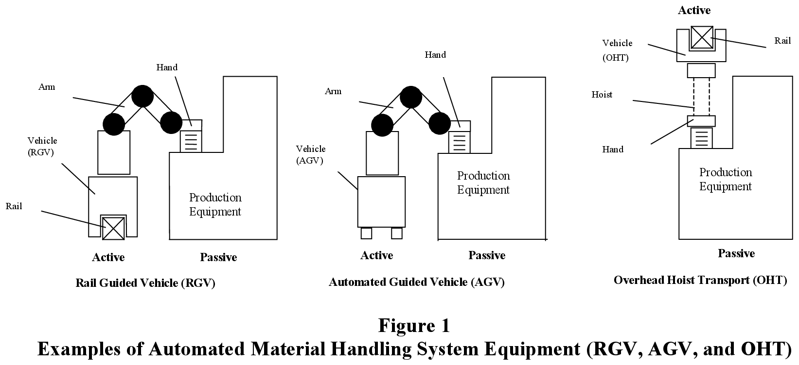

**图 1　自动化物料搬运系统设备示例（RGV、AGV 与 OHT）**

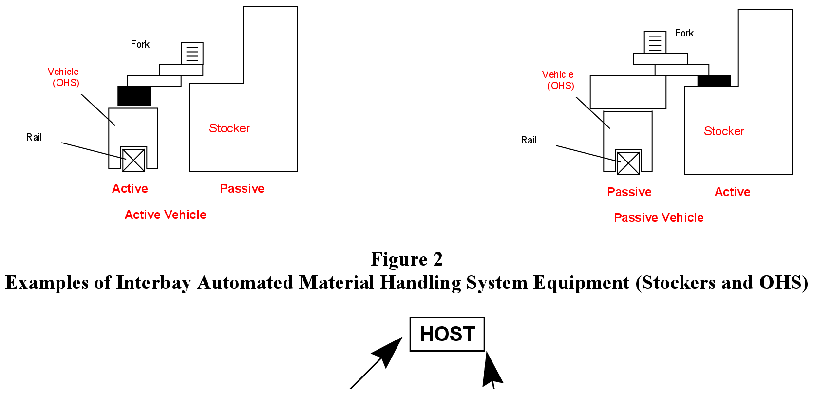

**图 2　跨区自动化物料搬运系统设备示例（储料机与 OHS）**

**2.2** 本增强载具交接并行 I/O 接口规范包括：

- 信号定义，含载口指定信号（见 6.1 节）；
- 载具交接时序定义与时序图（见 6.2 节）；
- 错误指示、检测与恢复（见 6.3 与 6.4 节）；
- 连接器类型、信号与引脚分配（见 6.4 节）；
- 位于载口处的接口传感器单元尺寸，由 SEMI E15.1 定义（适用于设计用于处理 300 mm 晶圆载具的系统）。

> ※ 译者注：上表第 3 项"错误指示、检测与恢复"原文标注为"见 6.3 **与 6.4** 节"，但实际内容在 **6.3 节**（6.4 节为连接器与引脚分配），属原文自身的交叉引用不一致。本译文按原文照译，此处予以说明。

**2.3** 本增强载具交接并行 I/O 接口控制主动设备向被动设备交接载具、以及从被动设备取走载具的过程。该并行 I/O 接口**仅**控制载具的自动交接动作。交接是指载具从一台设备转移到另一台设备的操作。该操作由主动设备与被动设备**共同**管理；工厂级控制器（即主机 host）不管理交接操作。图 3 给出了本文档所规定并行 I/O 接口的应用示例。

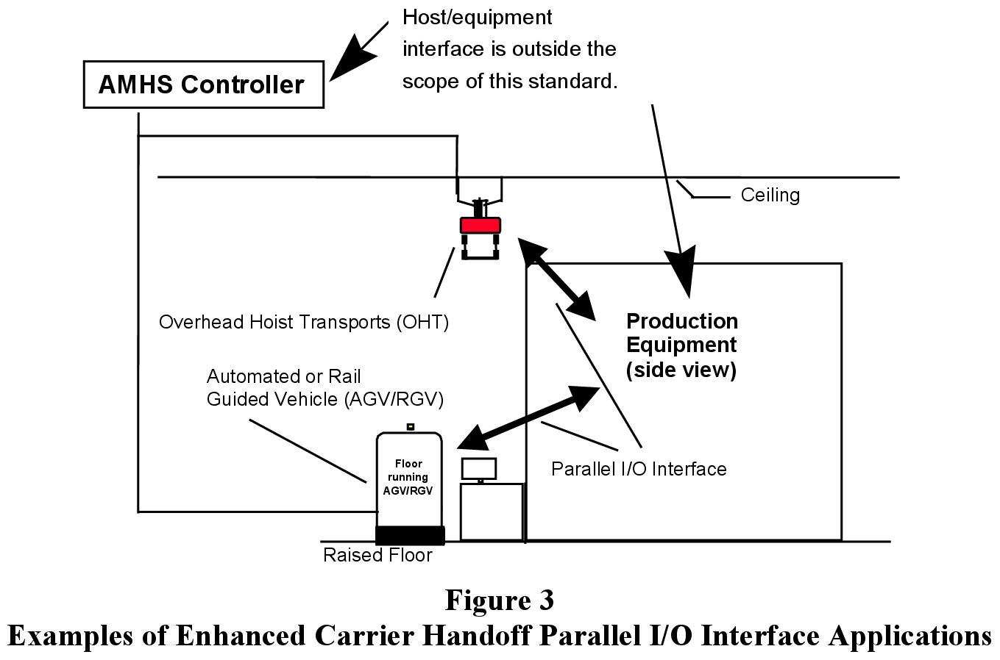

**图 3　增强载具交接并行 I/O 接口应用示例**

> ※ 译者注：图 3 是理解 E84 定位的关键。主机（HOST）与 AMHS 控制器之间的接口**不在**本标准范围内；E84 只管"AMHS 车辆 ↔ 生产设备"这一段硬线（或光耦）握手。也就是说，E84 是一套**与上位机无关的、纯硬件级的交接对讲协议**——这既是它的可靠性来源，也是它信息量有限的原因。

**2.4** 本标准无意解决与其使用相关的任何安全问题（如有）。使用者有责任在使用前建立适当的安全与健康规范，并确定法规限制的适用性。

---

## 3 限制

**3.1** 被交接物料的**数据**由设备的工厂接口（factory interface）管理。工厂级控制器对物料的管理不在本文档范围之内。

**3.2** 本规范定义了用于选择载口的信号，但**并行 I/O 接口与载口之间的物理对应关系**不在本文档中定义。

**3.3** 错误恢复流程可能需要操作员介入，和/或设备专有的私有流程。因此，错误恢复流程不在本文档中定义。

**3.4** 信号时序图仅适用于**一个**并行 I/O 接口。

**3.5** 并行 I/O 接口以及主动侧、被动侧连接器的**安装位置**未作定义。

**3.6** 对跨区 AMHS 设备（即 OHS、储料机）而言，**交换式交接（swap handoff）** 被视为超出本标准范围。交换式交接是指在同一载口上同时发生装载与卸载。

> ※ 译者注：3.6 这一条很关键——同一载口"先卸后装"必须走 6.2.4 的连续交接（Unload → Load）序列，而不是"同时装又卸"。

---

## 4 引用标准

### 4.1 SEMI 标准

| 标准号 | 标题 |
|---|---|
| SEMI E1.9 | 用于传输与存储 300 mm 晶圆的晶圆盒暂行机械规范 |
| SEMI E15.1 | 300 mm 设备载口暂行规范 |
| SEMI E23 | 晶圆盒传输并行 I/O 接口规范 |
| SEMI E30 | SEMI 设备通信与控制的通用模型（GEM） |
| SEMI E47.1 | 用于传输与存储 300 mm 晶圆的盒与舱（Box/Pod）暂行机械规范 |
| SEMI E87 | 载具管理暂行规范（CMS） |

### 4.2 ISO 标准

| 标准号 | 标题 |
|---|---|
| ISO 4902 <sup>1</sup> | 信息技术 — 数据通信 — 37 芯 DTE/DCE 接口连接器与触点编号分配 |

> <sup>1</sup> ISO Central Secretariat, 1, rue de Varembé, Case postale 56, CH-1211 Genève 20, Switzerland
>
> **注 2**：无论列出的还是修订的，所有被引用的文档均应采用已采纳标准的最新版本。

---

## 5 术语

| 编号 | 术语 | 定义 |
|---|---|---|
| 5.1 | **访问模式**（access mode） | 被动设备据以知晓哪一台 AMHS 设备（即 RGV、AGV、OHT/OHV）或哪位操作员被允许进行物料交接的模式。 |
| 5.2 | **主动设备**（active equipment） | 将晶圆盒装载到另一台设备的载具台上、或从另一台设备的载具台上卸下晶圆盒的设备 [SEMI E23]。 |
| 5.3 | **自动化物料搬运系统设备**（AMHS equipment） | 配有载具传输机器人、可在被动设备之间来回传输载具的设备。包括有轨导引车（RGV）、自动导引车（AGV）、空中吊运车（OHT）以及储料机。 |
| 5.4 | **自动访问模式**（automatic access mode） | 由 AMHS 设备（而非操作员）执行物料交接的模式。 |
| 5.5 | **载具**（carrier） | 任何装纳晶圆的晶圆盒、盒体、舱或 FOUP [SEMI E1.9]。亦称晶圆载具（wafer carrier）。 |
| 5.6 | **晶圆盒**（cassette） | 用于承载一片或多片基板的开放式结构 [SEMI E1.9]。亦称 open cassette（OC）。 |
| 5.7 | **连续交接**（continuous handoff） | 两个载具的相继交接。连续交接是**串行**的，即一次载具传输完成后立即接着下一次。连续交接可能涉及：装—装、卸—卸、或卸—装。 |
| 5.8 | **前开式统一舱**（FOUP） | 带不可拆卸晶圆盒（故其内部符合 SEMI E1.9）且带前开式接口（FIMS）的盒体（符合 SEMI E47.1）[SEMI E47.1]。 |
| 5.9 | **交接**（handoff） | 载具从一台设备转移（装载或卸载）到另一台设备的操作。 |
| 5.10 | **交接干涉区**（handoff conflict area） | 在交接操作期间，主动设备的运动机构可能与被动设备的运动机构发生干涉的区域。 |
| 5.11 | **交接互锁异常**（handoff interlock abnormal） | 一种状态，表示被动设备在交接操作中检测到异常条件；它可能意味着主动设备机构与被动设备机构已在交接干涉区内发生干涉。 |
| 5.12 | **交接不可用**（handoff unavailable） | 一种状态，表示被动设备当前不可用于物料交接操作。 |
| 5.13 | **载口**（load port） | 设备上放置晶圆载具以便设备处理晶圆的接口位置 [SEMI E15]。 |
| 5.14 | **手动访问模式**（manual access mode） | 由操作员（而非 AMHS 设备）执行载具物料交接的访问模式。 |
| 5.15 | **被动设备**（passive equipment） | 被主动设备装载或卸载的设备 [SEMI E23]。被动设备包括工艺设备、量测设备、储料机等。 |
| 5.16 | **同时交接**（simultaneous handoff） | 两个载具的**并发**交接操作。同时交接是**并行**的，即两个载具在同一时刻被传输。 |
| 5.17 | **单臂双手 AMHS 设备** | 使用单臂机构、带两只手（双末端执行器）来交接两个载具的 AMHS 设备。 |
| 5.18 | **单臂单手 AMHS 设备** | 使用单臂机构、带一只手（单末端执行器）来交接一个载具的 AMHS 设备。 |
| 5.19 | **单次交接**（single handoff） | 在一次交接操作中传输单个载具。 |

---

## 6 增强载具交接并行 I/O 接口要求

### 6.1 信号定义

**6.1.1** 表 1 给出了增强载具交接并行 I/O 接口所需的信号。该表定义了信号名、信息方向（P/A：**P** 代表被动设备，**A** 代表主动设备）以及说明。说明中给出信号的含义、信号电平的指示以及注释。

表 1 所定义的信号如下：

| 信号 | 全称 | 含义 |
|---|---|---|
| `VALID` | Valid | 表示信号跳变有效且已被选中 |
| `CS_0` | Carrier Stage 0 | 载具台位 0（载口选择） |
| `CS_1` | Carrier Stage 1 | 载具台位 1（载口选择） |
| `TR_REQ` | Transfer Request | 传输请求 |
| `L_REQ` | Load Request | 装载请求 |
| `U_REQ` | Unload Request | 卸载请求 |
| `READY` | READY for Transfer | 已就绪，可传输 |
| `BUSY` | BUSY for Transfer | 传输进行中 |
| `COMPT` | Complete Transfer | 传输完成 |
| `CONT` | Continuous Handoff | 连续交接 |
| `HO_AVBL` | Handoff Available | 可交接 |
| `ES` | Emergency Stop | 紧急停止 |
| `VA` | Vehicle arrived | 车辆已到达 |
| `AM_AVBL` | Transfer Arm Available | 传输臂可用 |
| `VS_0` | Carrier Stage 0 from Passive OHS Vehicle | 被动 OHS 车辆的载具台位 0 |
| `VS_1` | Carrier Stage 1 from Passive OHS Vehicle | 被动 OHS 车辆的载具台位 1 |

#### 表 1　增强载具交接并行 I/O 接口信号

| 信号名 | 方向 P/A | 说明 |
|---|---|---|
| **`VALID`** | A → P | 表示接口通信有效。 <br>ON：通信有效<br>OFF：通信无效<br>在本信号被置 ON 之前，必须先由 `CS_0` 和/或 `CS_1` 信号指定载口。 |
| **`CS_0`** | A → P | 指定用于载具交接的载口（见 6.1.2 载口指定信号）。<br>**一个 PI/O 对应一个载口**<br>　ON：使用该载口进行载具交接<br>　OFF：不适用<br>**一个 PI/O 对应两个载口**<br>　ON：使用**左**载口进行交接<br>　OFF：不使用左载口进行交接 |
| **`CS_1`** | A → P | 指定用于载具交接的载口（见 6.1.2 载口指定信号）。<br>**一个 PI/O 对应一个载口**<br>　不使用（恒为 OFF）<br>**一个 PI/O 对应两个载口**<br>　ON：使用**右**载口进行交接<br>　OFF：不使用右载口进行交接 |
| **`TR_REQ`** | A → P | 向被动设备请求交接。<br>ON：主动设备已请求交接<br>OFF：主动设备未请求交接<br>当 `BUSY` 信号跳变为 OFF 时，本信号被置 OFF。 |
| **`L_REQ`** | P → A | 表示该载口被指派为**装载**载具。`L_REQ` 始终表示载具由**主动侧向被动侧**传输。<br>ON：该载口被指派装载载具<br>OFF：该载口未被指派装载载具<br>当载口由 `CS_0` 和/或 `CS_1` 指定且 `VALID` 被置 ON 时，本信号置 ON。当该载口检测到载具位于正确位置时，本信号置 OFF。<br>在同时交接中，本信号置 ON 时两个载口上都不应存在载具；本信号置 OFF 时，两个载口上均应存在位于正确位置的载具。 |
| **`U_REQ`** | P → A | 表示该载口被指派为**卸载**载具。`U_REQ` 始终表示载具由**被动侧向主动侧**传输。<br>ON：该载口被指派卸载载具<br>OFF：该载口未被指派卸载载具<br>当载口由 `CS_0` 和/或 `CS_1` 指定且 `VALID` 被置 ON 时，本信号置 ON。当载口上的载具被取走时，本信号置 OFF。<br>在同时交接中，本信号置 ON 时两个载口上均应存在位于正确位置的载具；本信号置 OFF 时，两个载口上均不应存在载具。 |
| **`READY`** | P → A | 表示被动设备已接受主动设备的传输请求。<br>ON：被动设备已就绪，可交接<br>OFF：被动设备未就绪，不可交接<br>当被动设备接受传输请求时本信号置 ON；当 `COMPT` 信号置 ON 时本信号置 OFF。 |
| **`BUSY`** | A → P | 表示主动设备正在执行交接。<br>ON：交接进行中<br>OFF：无交接进行中<br>当主动设备开始交接操作时本信号置 ON。`BUSY` 置 ON 时 `READY` 必须为 ON。在主动设备完成交接、且其运动机构已移出交接干涉区之后，本信号必须置 OFF。**只要本信号为 ON，被动设备就不应在交接干涉区内执行任何机械动作。** 主动设备在确认 `L_REQ` 或 `U_REQ` 为 OFF 之后，才将 `BUSY` 置 OFF。 |
| **`COMPT`** | A → P | 表示主动设备已完成交接操作。<br>ON：交接已完成<br>OFF：交接未完成<br>当主动设备完成交接（`BUSY` 为 OFF）时本信号置 ON；在被动设备完成交接操作（`READY` 为 OFF）之后，本信号置 OFF。 |
| **`CONT`** | A → P | 指明本次交接为连续交接。<br>ON：连续交接<br>OFF：非连续交接<br>本信号在**第一个**载具交接的 `BUSY` 置 ON 时置 ON；在**最后一个**载具交接操作的 `BUSY` 置 ON 时置 OFF。<br>若被动设备存在会干涉交接的机构（如闸门 shutter door），则在连续交接期间该机构必须保持在非干涉状态（闸门必须保持开启）。 |
| **`HO_AVBL`** | P → A | 表示被动设备不可进行交接操作；也可能表示被动设备存在错误。<br>ON：可交接<br>OFF：因任何错误而不可交接<br>被动设备正常运行时本信号为 ON。当被动设备在由 `CS_0` 和/或 `CS_1` 指定的载口处检测到异常时，本信号因 `VALID` ON 或 `TR_REQ` ON 而被置 OFF。当被动设备的**其他**载口检测到异常时，本信号也可能被保持为 OFF。异常包括：<br>　- 载具检测不正确；<br>　- 被动设备已切换到手动访问模式；<br>　- 被动设备处于交接不可用状态。<br>本信号在交接操作开始之前向主动设备指示被动设备的状态。<br>关于载口访问模式与可用性状态的更多信息与要求，参见 SEMI E87。 |
| **`ES`** | P → A | 请求立即停止主动设备的动作。<br>ON：正常运行<br>OFF：请求停止（**注意为低有效**）<br>通常情况下，主动设备可以在 `VALID` ON 到 `VALID` OFF 期间监视 `ES` 信号。<br>当被动设备检测到危险状况时，本信号被置 OFF，以立即停止交接操作。危险状况包括可能对物料、产品或操作造成伤害的情形。被动设备正常运行时本信号为 ON；当被动设备需要停止主动设备的动作时它转为 OFF。被动设备可以在按下 `ES` 按钮时、或发生交接互锁异常时，将 `ES` 信号拉低。 |
| **`VA`** | P → A | 通知主动端：被动 OHS 车辆已到达。<br>表示车辆已到达载口时接口通信有效。<br>ON：车辆已到达，通信有效<br>OFF：车辆未到达，通信无效<br>在本信号置 ON 之前，必须先由 `VS_0` 和/或 `VS_1` 信号指定载口。<br>**注：本信号仅用于跨区被动 OHS 车辆。** |
| **`AM_AVBL`** | A → P | 通知被动 OHS 车辆：搬运臂可用。 |
| **`VS_0`** | P → A | 被动 OHS 车辆用于向主动端通报装载或卸载位置的信号。指定用于载具交接的载口。<br>**一个 PI/O 对应一个载口**<br>　ON：使用该载口进行载具交接<br>　OFF：不适用<br>**一个 PI/O 对应两个载口**<br>　ON：使用**左**载口进行交接<br>　OFF：不使用左载口进行交接<br>**注：本信号仅用于跨区被动 OHS 车辆。** |
| **`VS_1`** | P → A | 被动 OHS 车辆用于向主动端通报装载或卸载位置的信号。指定用于载具交接的载口。<br>**一个 PI/O 对应一个载口**<br>　OFF：不使用<br>**一个 PI/O 对应两个载口**<br>　ON：使用**右**载口进行交接<br>　OFF：不使用右载口进行交接<br>**注：本信号仅用于跨区被动 OHS 车辆。** |

> ※ 译者注：`ES` 是**低有效**（negative logic）信号——**ON = 正常，OFF = 请求停止**。这是 E84 接线与调试中最容易搞反的一处。表 1 中被动设备侧的 `ES` 与 `HO_AVBL` 都是"低有效/故障拉低"语义。
>
> ※ 译者注：`VALID`、`CS_0`、`CS_1` 三个信号**不用于**跨区 AMHS 设备（被动 OHS 车辆）；跨区场景下改用 `VA`、`AM_AVBL`、`VS_0`、`VS_1`。

---

#### 6.1.2 载口指定信号

**6.1.2.1** 信号 `CS_0` 与 `CS_1` 用于选择交接所使用的载口。对于**专用于单个载口**的并行 I/O 接口，这两个信号必须设置为：

```
CS_0  ON
CS_1  OFF
```

参见图 4 与图 5。

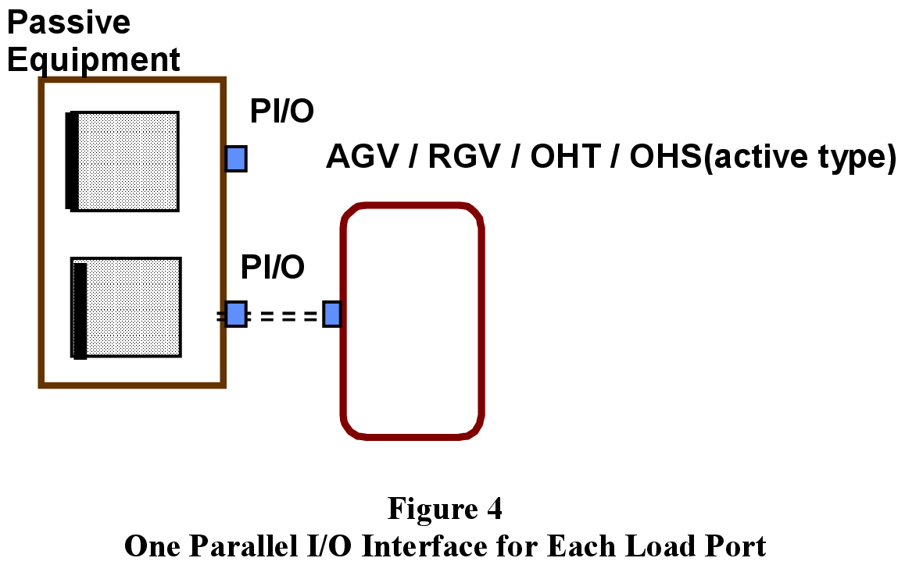

**图 4　每个载口一个并行 I/O 接口**

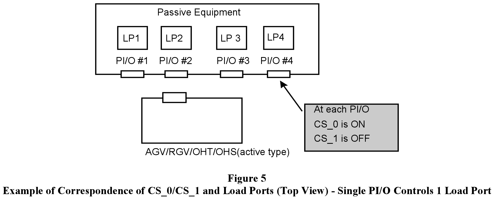

**图 5　`CS_0`/`CS_1` 与载口对应关系示例（俯视图）——单个 PI/O 控制 1 个载口**

> **注 1**：本图仅示出逻辑概念，物理位置不由本标准定义。

**6.1.2.2** 用一个共用并行 I/O 接口控制**两个**载口的能力是被要求的；因此，本规范假定一个共用并行 I/O 接口可用于控制两个载口的交接。

**6.1.2.3** 当两个载口共用同一个并行 I/O 接口时，载口的指派才有意义。主动设备应通过 `CS_0` 和/或 `CS_1` 信号来选择载口（见图 6）。

- `CS_0` 选择**面向设备载口时**的**左手**载口。
- `CS_1` 选择**面向设备载口时**的**右手**载口。

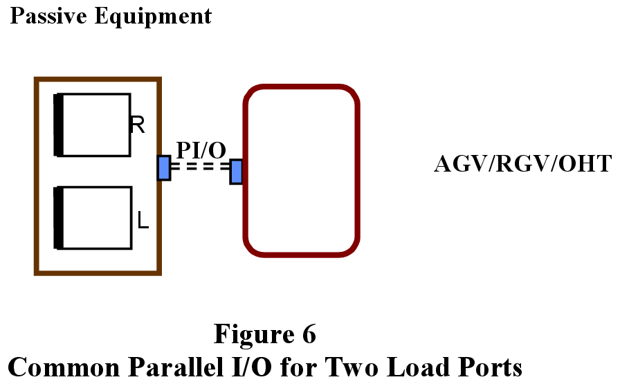

**图 6　两个载口共用的并行 I/O**

> **注 1**：本图仅示出逻辑概念，物理位置不由本标准定义。

**6.1.2.4** 对于同时交接，`CS_0` 与 `CS_1` **必须同时置为 ON**。图 8 给出了一台拥有四个载口（LP1、LP2、LP3、LP4）和两个并行 I/O 接口（PI/O#1、PI/O#2）的被动设备，其中 PI/O#1 为载口 LP1 与 LP2 共用，PI/O#2 为载口 LP3 与 LP4 共用。表 2 与表 3 给出了信号组合的取值范围。

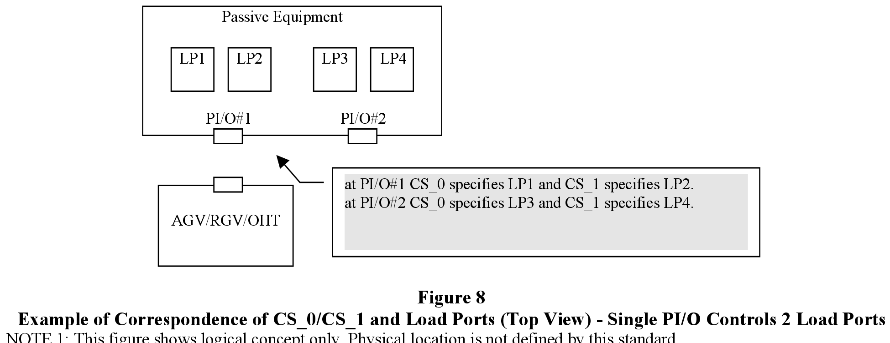

**图 8　`CS_0`/`CS_1` 与载口对应关系示例（俯视图）——单个 PI/O 控制 2 个载口**

> **注 1**：本图仅示出逻辑概念，物理位置不由本标准定义。

#### 6.1.3 OHS（被动型）的载口指定信号

**6.1.3.1** 信号 `VS_0` 与 `VS_1` 用于选择交接所使用的载口。对于**专用于单个载口**的并行 I/O 接口，这两个信号必须设置为：

```
VS_0  ON
VS_1  OFF
```

**6.1.3.2** 通过 `VS_0` 与 `VS_1` 可以控制两个载口：

- `VS_0`　ON：选择左手载口；OFF：不选择左手载口。
- `VS_1`　ON：选择右手载口；OFF：不选择右手载口。

`VS_0` 与 `VS_1` 是**各自独立**控制的。

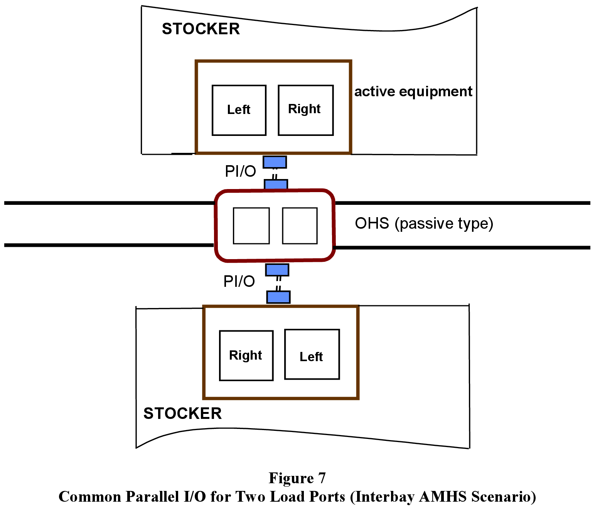

**图 7　两个载口共用的并行 I/O（跨区 AMHS 场景）**

> **注 1**：本图仅示出逻辑概念，物理位置不由本标准定义。
> **注 2**：左、右侧的判定依据是从车辆看向设备的方向。

#### 表 2　由 `CS_0`/`CS_1` 信号指定的载口示例（一个 PI/O 对应 2 个载口）

| PI/O# | `CS_0` | `CS_1` | 载口 | 备注 |
|---|---|---|---|---|
| 1 | ON | OFF | LP1 | 单次交接或连续交接 |
| 1 | OFF | ON | LP2 | 单次交接或连续交接 |
| 1 | ON | ON | LP1 & LP2 | 同时交接 |
| 2 | ON | OFF | LP3 | 单次交接或连续交接 |
| 2 | OFF | ON | LP4 | 单次交接或连续交接 |
| 2 | ON | ON | LP3 & LP4 | 同时交接 |

#### 表 3　由 `CS_0`/`CS_1` 信号指定的载口示例（一个 PI/O 对应 1 个载口）

| PI/O# | `CS_0` | `CS_1` | 载口 | 备注 |
|---|---|---|---|---|
| 1 | ON | OFF | LP1 | 当 PI/O 专用于单个载口时，`CS_0` 恒为 ON，`CS_1` 恒为 OFF。 |
| 2 | ON | OFF | LP2 | |
| 3 | ON | OFF | LP3 | |
| 4 | ON | OFF | LP4 | |

#### 表 4　由 `VS_0`/`VS_1` 信号指定的载口示例（一个 PI/O 对应 2 个载口）

| | | 左载口 | 右载口 |
|---|---|---|---|
| **`VS_0`** | ON | ○ | ✕ |
| | OFF | ✕ | ✕ |
| **`VS_1`** | ON | ✕ | ○ |
| | OFF | ✕ | ✕ |

图例：○ = 选中　✕ = 未选中　（空白）= 不关心

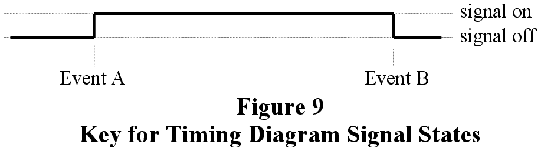

**图 9　时序图信号状态图例（Key for Timing Diagram Signal States）**

> ※ 译者注：图 9 是读懂后面所有时序图（图 10–图 20）的钥匙。它说明时序图中信号的画法：**信号 ON（有效）= 上方那条线，"signal on"；信号 OFF = 下方那条线。** 也就是说后续所有时序图里，波形**抬到上沿代表信号有效**，落回下沿代表无效。`Event A` / `Event B` 表示两个事件时刻，用于标注事情发生的时点。

---

### 6.2 载具交接时序

**6.2.1** 符合本规范的增强载具交接并行 I/O 接口，其信号必须遵循下述已定义的时序。载具交接时序的时序图见图 10–图 20。

#### 6.2.2 单次交接时序（装载/卸载）

**6.2.2.1** 单次交接中装载与卸载操作的时序图分别见图 10 与图 11。图 10、图 11 所示的时序如下：

**1)** 主动设备（AMHS 设备）到达载口前方的交接位置后，主动设备通过 `CS_0` 与 `CS_1` 指明它要向被动设备交接载具的载口编号。

**2)** 主动设备将 `VALID` 信号置 ON，表示 `CS_0`、`CS_1` 的信号跳变**有效**。

> **注 3**：被动设备在主动设备将 `VALID` 置 ON（即表明接口通信有效）之前，不应去校验 `CS_0` 或 `CS_1` 是否为 ON。

**3)** 若载口已准备好执行**装载**操作，被动设备将 `L_REQ` 信号置 ON；若载口已准备好执行**卸载**操作，则置 `U_REQ` 为 ON。

**4)** 为请求被动设备启动载具交接操作，主动设备将 `TR_REQ` 信号置 ON。

**5)** 当被动设备准备好交接载具时，它将 `READY` 信号置 ON。

**6)** 主动设备确认 `READY` 为 ON 后，将 `BUSY` 信号置 ON，并开始交接动作。

**7)** 当载具被正确放置到载口上（或载口上的载具被取走）时，被动设备将 `L_REQ`（`U_REQ`）信号置 OFF。

**8)** 装载或卸载动作完成、且主动设备的运动机构已退出交接干涉区之后，主动设备将 `BUSY` 置 OFF。**主动设备必须在 `BUSY` 置 OFF 之前确认 `L_REQ`（`U_REQ`）已为 OFF。**

**9)** 主动设备在 `BUSY` 置 OFF 的同时将 `TR_REQ` 置 OFF。

**10)** 主动设备将 `COMPT` 信号置 ON，通知被动设备交接操作已完成。

> **注 4**：若被动设备要校验 `BUSY` 与 `TR_REQ` 是否为 OFF，它应当只在主动设备已将 `COMPT` 置 ON（表明主动设备已完成交接）**之后**才去校验这两个信号。

**11)** 确认主动设备已把 `COMPT` 置 ON 之后，被动设备将 `READY` 信号置 OFF。

**12)** `READY` 置 OFF 之后，主动设备将 `COMPT`、`VALID`、`CS_0`、`CS_1` 信号全部置 OFF。

**13)** 当 `VALID` 信号被置 OFF 时，与被动设备的握手**闭合**（本次交接结束）。

> **注 5**：若被动设备要检查 `COMPT`、`VALID` 以及 `CS_0` 或 `CS_1` 信号，它应允许这些信号以**任意顺序**置 OFF，而不因此报错。

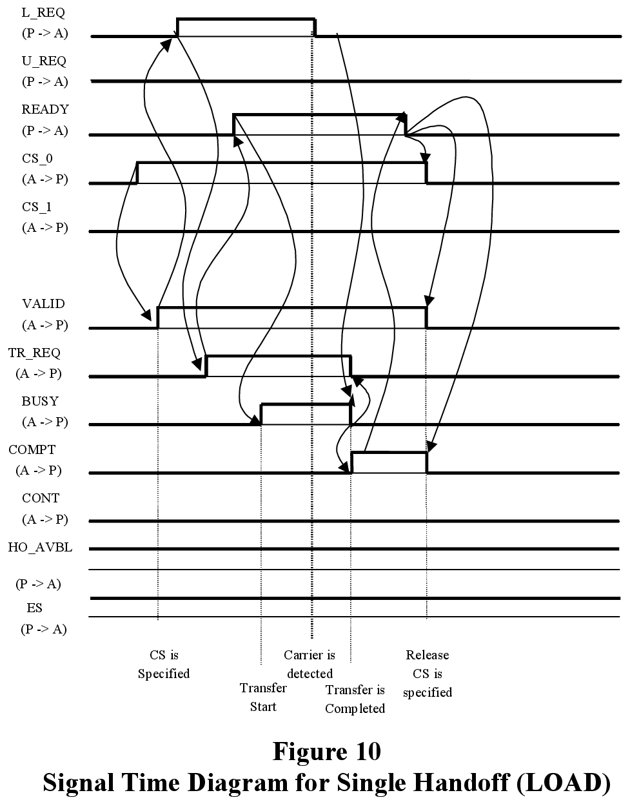

**图 10　单次交接信号时序图（LOAD，装载）**

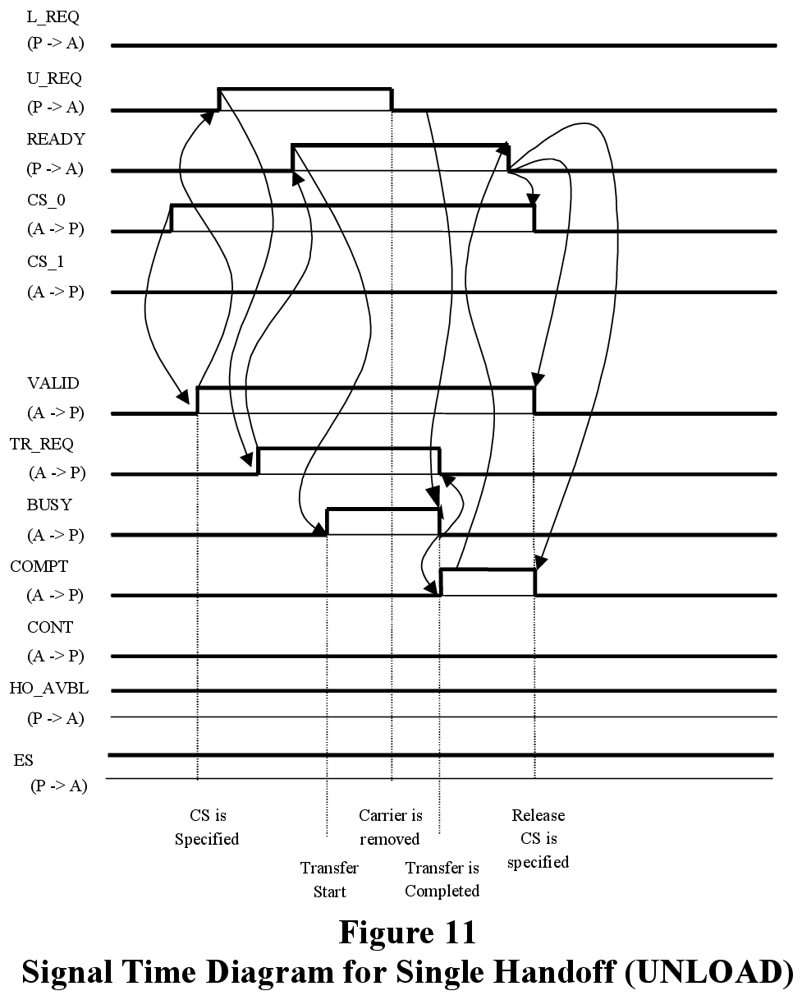

**图 11　单次交接信号时序图（UNLOAD，卸载）**

> ※ 译者注：把上述 13 步压缩成一张表，就是 E84 单次握手的主干。**掌握下面这张表，等于掌握了 E84 的全部骨架**——后文的同时交接、连续交接都只是它的变体。

| 步 | 动作方 | 信号变化 | 物理含义 |
|---|---|---|---|
| 1 | 主动 | `CS_0`/`CS_1` 置位 | "我要用这个（这些）载口" |
| 2 | 主动 | `VALID` ↑ | "上面的载口选择有效，通信开始" |
| 3 | 被动 | `L_REQ` 或 `U_REQ` ↑ | "我这边是要装还是要卸" |
| 4 | 主动 | `TR_REQ` ↑ | "请开始" |
| 5 | 被动 | `READY` ↑ | "我准备好了" |
| 6 | 主动 | `BUSY` ↑ | "我开始动了，干涉区内别动" |
| 7 | 被动 | `L_REQ`/`U_REQ` ↓ | "料已到位 / 料已取走" |
| 8 | 主动 | `BUSY` ↓ | "我已完成并退出干涉区" |
| 9 | 主动 | `TR_REQ` ↓ | |
| 10 | 主动 | `COMPT` ↑ | "交接完成" |
| 11 | 被动 | `READY` ↓ | "收到，收尾" |
| 12 | 主动 | `COMPT`/`VALID`/`CS_0`/`CS_1` ↓ | 释放 |
| 13 | — | `VALID` ↓ | **握手闭合** |

> ※ 译者注：两个最容易被忽略的**顺序约束**：①第 2 步必须先有 `CS_0/CS_1` 再抬 `VALID`（注 3）；②第 8 步主动设备必须先看到 `L_REQ/U_REQ` 落下才允许落 `BUSY`（第 8 步正文）。这两条是现场"卡死"故障的高发点。

#### 6.2.2.2 OHS（跨区被动型车辆）与储料机之间的单次交接时序

本节定义 OHS（跨区被动型车辆）与储料机（Stocker）之间的单次交接时序。单次交接中装载与卸载操作的时序图分别见图 12 与图 13。图 12、图 13 所示的时序如下：

**1)** 当被动设备（即 OHS）到达主动设备（即储料机）处时，被动设备通过 `VS_0` 与 `VS_1` 向主动设备指明交接将在何处进行。

**2)** 在 `VS` 置位的同时，若载口准备好执行**装载**操作，被动设备将 `L_REQ` 信号置 ON；若载口准备好执行**卸载**操作，则置 `U_REQ` 为 ON。

**3)** 被动设备将 `VA` 信号置 ON，表示 `VS_0`、`VS_1` 以及 `L_REQ` 或 `U_REQ` 的信号跳变**有效**。

**4)** 主动设备识别到 `VA` 信号后，检查 `VS_0`、`VS_1`、`L_REQ` 与 `U_REQ` 信号，并将 `TR_REQ` 信号置 ON，请求被动设备启动载具交接操作。

**5)** 当被动设备准备好交接载具时，它将 `READY` 信号置 ON。

**6)** 主动设备确认 `READY` 为 ON 后，将 `BUSY` 信号置 ON，并开始交接动作。

**7)** 当载具被正确放置到载口上（或载口上的载具被取走）时，被动设备将 `L_REQ`（`U_REQ`）信号置 OFF。

**8)** 装载或卸载动作完成、且主动设备已退出交接干涉区之后，主动设备将 `BUSY` 置 OFF。主动设备必须在 `BUSY` 置 OFF 之前确认 `L_REQ`（`U_REQ`）已为 OFF。

**9)** 主动设备在 `BUSY` 置 OFF 的同时将 `TR_REQ` 置 OFF。

**10)** 主动设备将 `COMPT` 信号置 ON，通知被动设备交接操作已完成。

**11)** 确认主动设备已把 `COMPT` 置 ON 之后，被动设备将 `READY` 信号置 OFF。

**12)** `READY` 置 OFF 之后，主动设备将 `COMPT` 置 OFF。

**13)** 确认主动设备已将 `COMPT` 置 OFF 之后，被动设备将 `VS_0`、`VS_1` 与 `VA` 置 OFF。

**14)** 当 `VA` 信号被置 OFF 时，与被动设备的握手闭合。

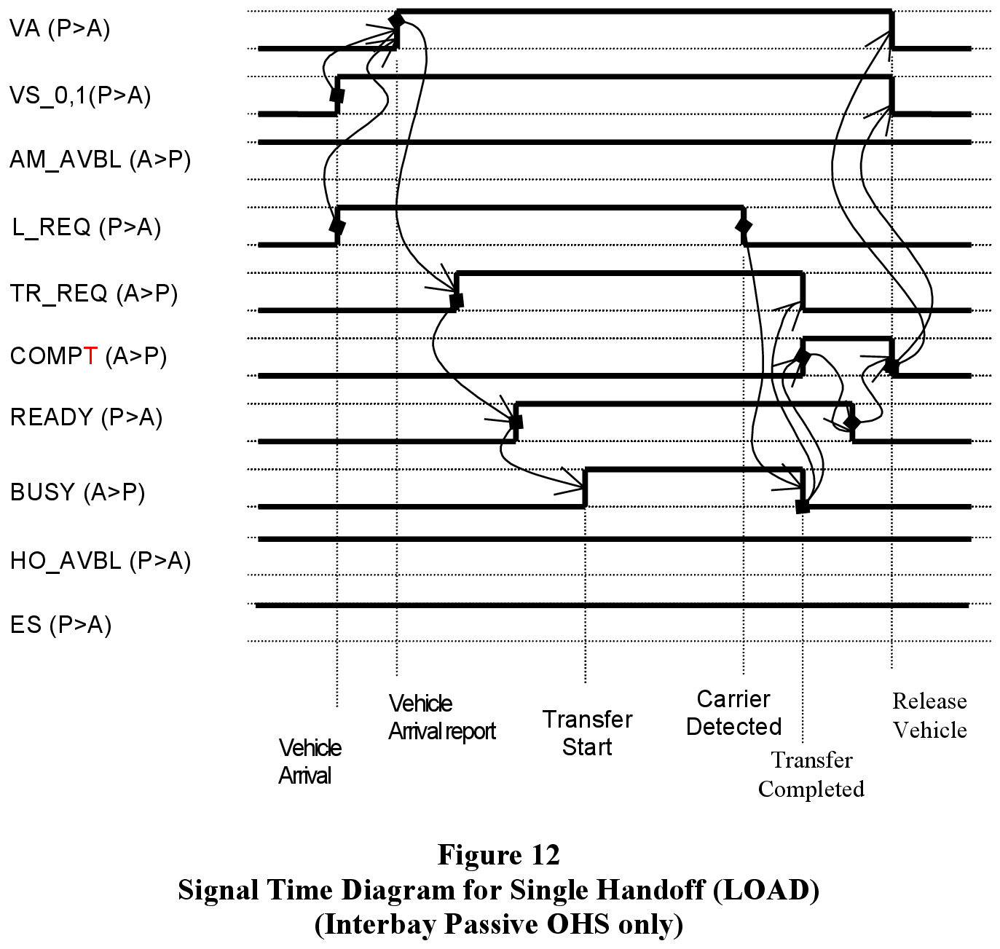

**图 12　单次交接信号时序图（LOAD，装载）——仅用于跨区被动 OHS**

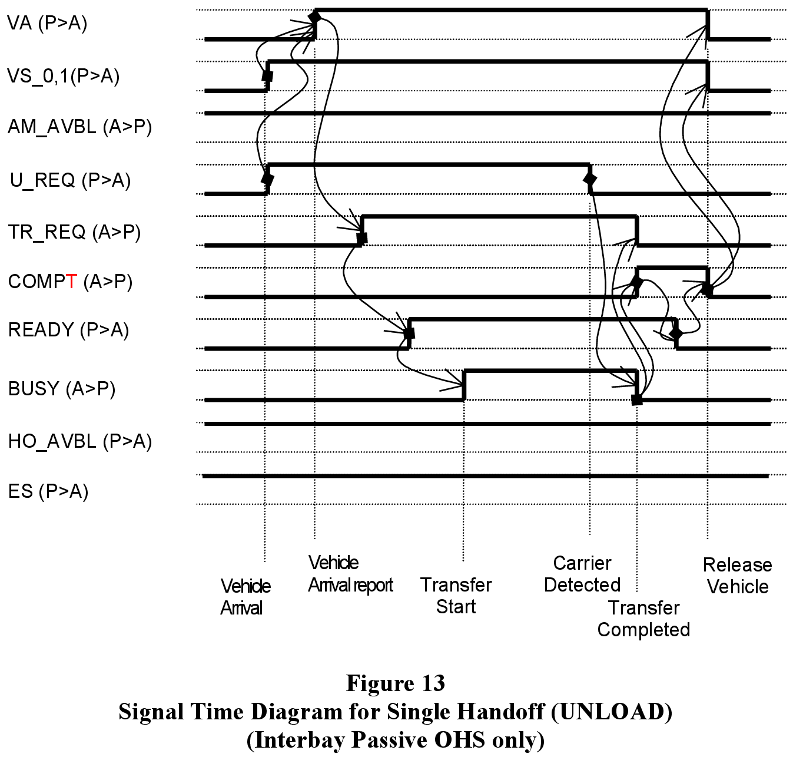

**图 13　单次交接信号时序图（UNLOAD，卸载）——仅用于跨区被动 OHS**

> ※ 译者注：跨区场景（OHS ↔ 储料机）里，角色发生了**反转**——**OHS 是被动设备**，储料机是主动设备。而且握手信令换了一整套：`CS_0/CS_1/VALID` 不再使用，改用 `VS_0/VS_1/VA`；开局的"请求"方向也反过来，由被动方（OHS）先发 `VS_x` 和 `VA`。这是 E84 里最容易混淆的一点：**同一根线上谁先说第一句话，取决于配置**。

#### 6.2.3 同时交接时序（装载）

**6.2.3.1** 本规范定义了控制同时交接的能力。**同时交接**是指主动设备在一次传输动作中把两个载具同时送到两个载口上的交接操作。某些类型的 AMHS 设备能够在一次传输动作中同时搬运两个载具。该能力可用于提升传输性能。例如，同时交接可应用于单臂双手、能够在一次传输动作中搬运两个载具的 AMHS 设备。

**6.2.3.2** 同时交接的时序图见图 14。该图只示出**装载**操作；对于卸载操作，可将 `L_REQ` 替换为 `U_REQ`。同时交接的时序与单次交接相同，只是**用 `CS_0` 与 `CS_1` 指定载口的方式**、以及 **`L_REQ`/`U_REQ` 的 ON/OFF 定义**有所不同。与图 10、图 11 不同之处如下：

**1)** 主动设备将 `CS_0` 与 `CS_1` 信号**同时置 ON**，告知被动设备这是一次同时交接。

**2)** 在 `CS_0` 与 `CS_1` 的跳变生效之后，主动设备将 `VALID` 信号置 ON。

**3)** 当指定的两个载口（`CS_0` 与 `CS_1` 对应的载口）上的两个载具都已准备好被装载（或被卸载）时，被动设备将 `L_REQ`（`U_REQ`）信号置 ON。

**4)** 当两个载口上都检测到载具（或两个载口上的载具都被取走）时，`L_REQ`（`U_REQ`）信号被置 OFF。

**6.2.3.3** 本规范定义了控制同时交接的能力。同时交接是指主动设备在一次传输动作中把两个载具同时送到两个载口上的交接操作。某些类型的跨区 AMHS 设备（即储料机）能够在一次传输动作中同时搬运两个载具。该能力可用于提升传输性能。例如，同时交接可应用于单臂双手、能够在一次传输动作中搬运两个载具的 AMHS 设备。

**6.2.3.3.1** 使用被动 OHS 车辆进行跨区同时交接的时序图见图 15。该图只示出**装载**操作；对于卸载操作，可将 `L_REQ` 替换为 `U_REQ`。同时交接的时序与单次交接相同，只是**用 `VS_0` 与 `VS_1` 指定载口的方式**、以及 **`L_REQ`/`U_REQ` 的 ON/OFF 定义**有所不同。

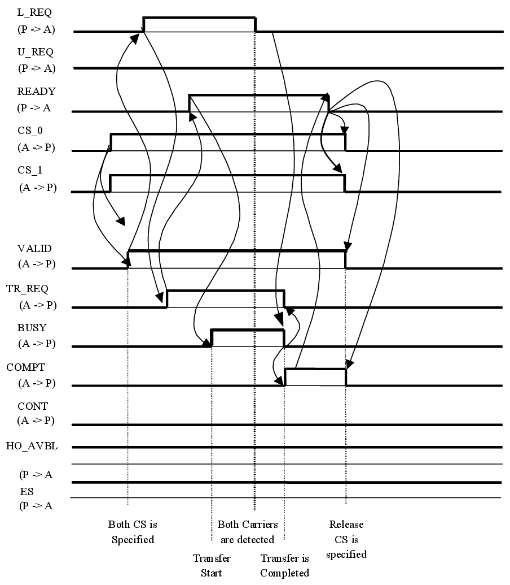

**图 14　同时交接信号时序图（LOAD，装载）**

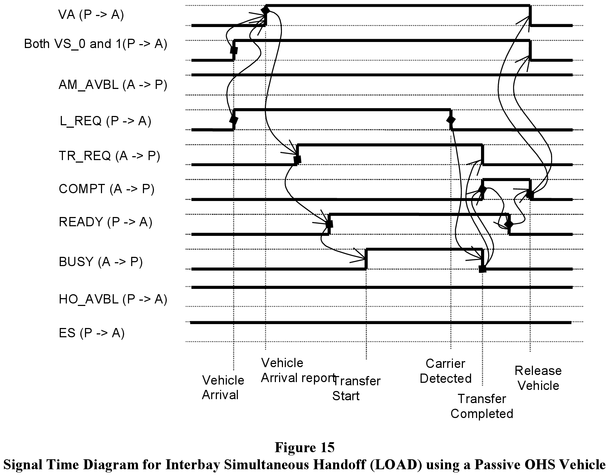

**图 15　使用被动 OHS 车辆的跨区同时交接信号时序图（LOAD，装载）**

> ※ 译者注：同时交接与单次交接的**唯一区别**就是"载口选择的语义"：单次交接里 `CS_0=ON, CS_1=OFF` 表示"用左载口"；同时交接里 `CS_0=ON, CS_1=ON` 表示"两个都用"。相应地，`L_REQ`/`U_REQ` 的含义从"这一个载口"变成"**两个**载口都到位了/都取走了"——即它变成了一个**"两个都好了"的与（AND）语义**。注意 `HO_AVBL` 在这类时序图里画成了一条斜线，表示图中假设它恒为 ON（可交接）。

#### 6.2.4 连续交接时序

**6.2.4.1** 本规范定义了控制连续交接的能力。**连续交接**是指主动设备在一次载具传输动作中，依次、连续地搬运两个或更多载具的交接操作。某些类型的 AMHS 设备能够在一次传输动作中交接两个以上的载具。该能力可用于提升传输性能。

**6.2.4.2** 当被动设备在载口前方装有闸门时，该闸门必须在主动设备开始载具交接**之前**开启。当需要搬运两个或更多载具时，每个载具交接都开关一次闸门是多余的。因此，在载具传输操作期间闸门应**保持开启**。连续交接正是为了消除这类冗余动作而被用于传输操作的。

**6.2.4.3 在同一载口上连续交接的时序（卸载 → 装载）**：连续交接的示例时序图见图 16。该示例展示了在同一载口上连续执行的卸载与装载操作的时序。连续交接中的每一段时序都是单次交接时序的组合。此外，还要用 `CONT` 信号来指明这是一次连续交接。

在图 16 所示的时序中，先卸载载口上的载具，再向该载口装载一个新载具。`CONT` 信号在**第一次**交接的主动设备 `BUSY` 置 ON 时被置 ON，以表明交接是连续的。在后续的装载时序中，**指定同一个载口编号**（本例中为 `CS_0`）以使用同一个载口。在本例中，第二次装载时序之后不再有需要搬运的载具，因此主动设备在第二次交接的 `BUSY` 信号置 ON 时**将 `CONT` 置 OFF**，表明连续交接已完成。

**6.2.4.4 在不同载口上连续交接的时序（装载 → 装载）**：在不同载口上进行连续交接的示例时序图见图 17。在本例中，主动设备先把一个载具送到 `CS_0` 对应的载口，再把另一个载具送到 `CS_1` 对应的载口。本例的时序与上一节所述的连续交接（同一载口：卸载 → 装载）相同，只是**载口的指定方式**不同。

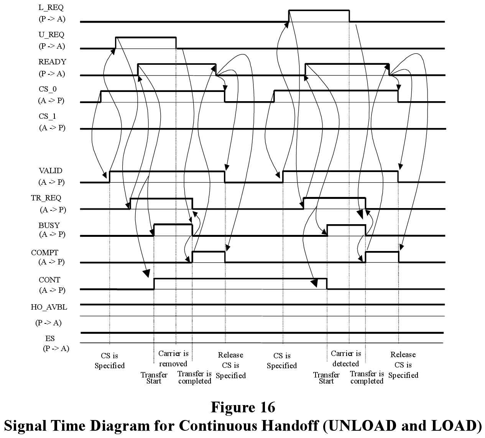

**图 16　连续交接信号时序图（UNLOAD and LOAD，卸载与装载）**

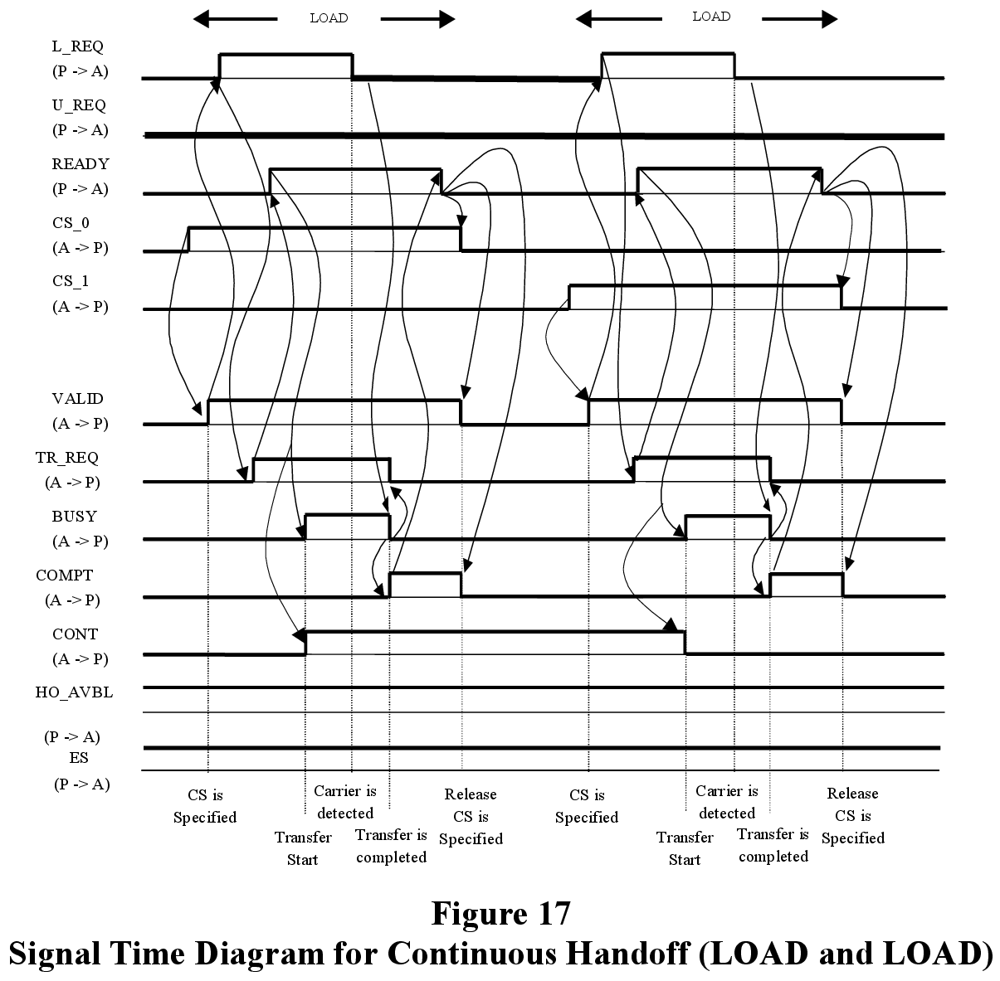

**图 17　连续交接信号时序图（LOAD and LOAD，装载与装载）**

> ※ 译者注：`CONT` 的语义是"**后面还有**"——它在**第一次**交接的 `BUSY` 上升沿置 ON，在**最后一次**交接的 `BUSY` 上升沿置 OFF。因此被动设备（如带闸门/Load Port 门）只要盯住 `CONT` 就能判断"这批活干完没有、闸门能不能关"。图 16 的 `CONT` 波形只在第一段抬起、第二段就落下，正对应"两段活，第二段是最后一段"。
>
> ※ 译者注：连续交接**不是**一种新的握手，而是**多次单次握手的无缝拼接**——`VALID` 在整批过程中保持 ON 不断开（对比图 10，单次交接结束时 `VALID` 会落下）。这正是它省时间的地方：省掉了每颗料之间重新 `VALID` 上下、重新选口、重新校验的开销。

#### 6.2.5 可交接信号时序（`HO_AVBL`）

**6.2.5.1** `HO_AVBL` 信号的示例时序图见图 18 与图 19。`HO_AVBL` 信号在被动设备正常运行期间为 ON；当被动设备检测到任何与交接相关的异常时，应将其置 OFF。主动设备通过 `HO_AVBL` 信号获知异常状况。主动设备应在以下时段内确认 `HO_AVBL` 信号：

- **a)** 从 `VALID` 信号被置 ON 起，到 `L_REQ` 或 `U_REQ` 信号被置 ON 止；
- **b)** 从 `TR_REQ` 信号被置 ON 起，到 `READY` 信号被置 ON 止。

**6.2.5.2** 图 18 是解释上述情况 **a)** 的时序图。当主动设备检测到被动设备把 `HO_AVBL` 置 OFF 时，它**停止**交接操作，并把 `VALID` 信号置 OFF 以闭合握手（此时 `CS_0` 与 `CS_1` 信号必须置 OFF）。被动设备在 `VALID` 信号被置 OFF **之后**，才把 `HO_AVBL` 信号重新置 ON（此时 `L_REQ` 或 `U_REQ` 必须已置 OFF）。

**6.2.5.3** 图 19 是解释上述情况 **b)** 的时序图。当主动设备检测到被动设备把 `HO_AVBL` 置 OFF 时，它停止交接操作，并把 `VALID` 信号置 OFF 以闭合握手（此时 `CS_0`、`CS_1` 与 `TR_REQ` 信号必须置 OFF）。被动设备在 `VALID` 信号被置 OFF **之后**，才把 `HO_AVBL` 信号重新置 ON（此时 `L_REQ` 或 `U_REQ` 必须已置 OFF）。

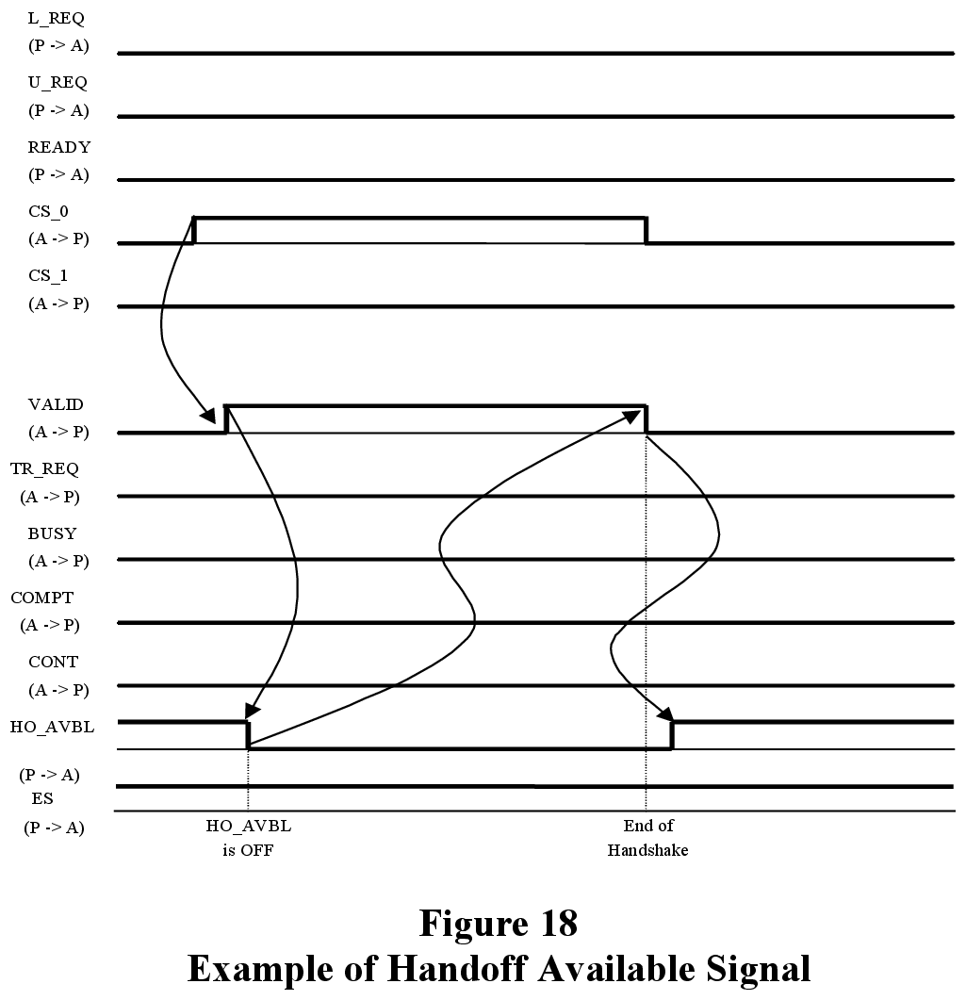

**图 18　可交接信号（`HO_AVBL`）示例——对应 6.2.5.1 情况 a)**

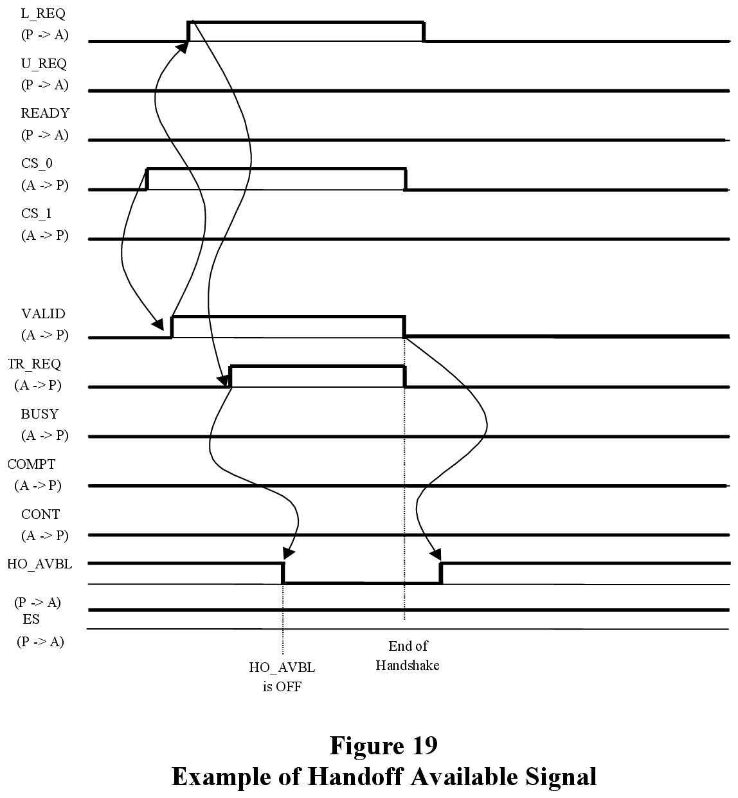

**图 19　可交接信号（`HO_AVBL`）示例——对应 6.2.5.1 情况 b)**

#### 6.2.6 可交接信号时序（用于跨区被动 OHS 与储料机）

**6.2.6.1** `HO_AVBL` 信号的示例时序图见图 18 与图 19。`HO_AVBL` 信号在被动 OHS 正常运行期间为 ON；当被动 OHS 检测到任何与交接相关的异常时，应将其置 OFF。主动储料机通过 `HO_AVBL` 信号获知异常状况。主动储料机应在以下时段内确认 `HO_AVBL` 信号：

- **a)** 从 `TR_REQ` 信号被置 ON 起，到 `READY` 信号被置 ON 止。

**6.2.6.2** 图 20 是解释上述 **a)** 项的图。当主动储料机检测到被动 OHS 已把 `HO_AVBL` 信号置 OFF 时，它**停止**搬运。主动储料机通过**关闭 `AM_AVBL` 信号**来结束传输时序；在这种情况下，`TR_REQ` 信号必须随传输时序结束而置 OFF。同时，被动 OHS 必须将 `VS_0` 与 `VS_1` 信号置 OFF。接下来，被动 OHS 必须在 `VA` 信号变低**之后**才把 `HO_AVBL` 信号重新置 ON（此时 `L_REQ` 或 `U_REQ` 必须已置 OFF）。

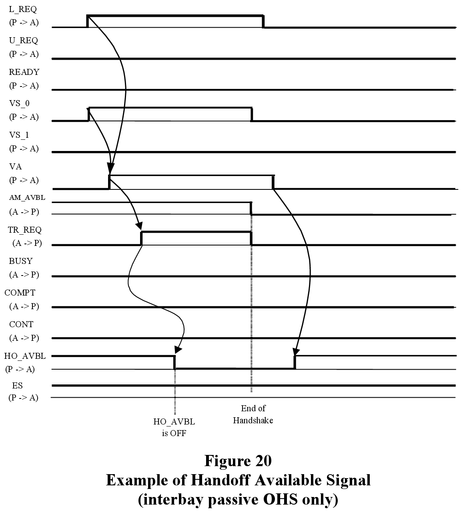

**图 20　可交接信号（`HO_AVBL`）示例——仅用于跨区被动 OHS**

> ※ 译者注：`HO_AVBL` 是整条 E84 链路上**唯一的"被动方主动喊停"通道**，非常关键。它设计成**低有效**（平时 ON，出事拉低），好处是：断线、掉电、被动设备死机都会让线变成 OFF，从而被主动设备当成"不可交接"——即**故障安全（fail-safe）**。这就是为什么表 1 里写"OFF: handoff is unavailable **with any error**"。
>
> ※ 译者注：主动设备**只在两个窗口内**检查 `HO_AVBL`（6.2.5.1 的 a 和 b）。窗口之外的 `HO_AVBL` 抖动静默忽略——实现时不要写成全程中断触发，否则容易误报。另外注意时序图的闭合顺序：**永远是主动方先收 `VALID`，被动方再恢复 `HO_AVBL`**，不能反过来。

---

### 6.3 错误指示、检测与恢复

#### 6.3.1 错误指示

**6.3.1.1** 为支撑运行可靠性，本规范定义了以下在接口上指示错误的能力：

**a)** 通知**交接不可用**——即被动设备（或被动 OHS）不能向主动设备提供物料交接操作；
**b)** 通知**紧急停止请求**给主动设备（或主动储料机）；
**c)** 通知**交接超时错误**。

#### 6.3.2 错误检测

**6.3.2.1** 要用**互锁超时**（interlock timeout）来检测主动设备与被动设备之间的交接时序错误。本规范定义了主动设备与被动设备各自应监视的互锁超时。表 5 给出主动设备的互锁超时，表 6 给出被动设备的互锁超时。

`TAx`（x 为数字）表示主动设备的定时器，`TPx`（x 为数字）表示被动设备的定时器。**除 `TD0` 之外**，所有定时器的取值范围均为 **1 秒到 999 秒**。所有定时器的设定值都应**可由用户编程**。

#### 表 5　主动设备定时器

| 定时器名 | 监视的时段（信号状态） | 范围（秒） | 典型值 TYP（秒） |
|---|---|---|---|
| `TA1` | `VALID` ON — `L_REQ` ON<br>`VALID` ON — `U_REQ` ON | 1–999 | 2 |
| `TA2` | `TR_REQ` ON — `READY` ON | 1–999 | 2 |
| `TA3` | `COMPT` ON — `READY` OFF | 1–999 | 2 |

> **注 1**：定时器的最小值**并不**定义主动设备的响应时间。
> **注 2**：这些定时器值必须被实现以用于检测超时，而**不是**用来规定信号之间的延时时间。设备响应时间必须快于该定时器的超时时间。

#### 表 6　被动设备定时器

| 定时器名 | 监视的时段（信号状态） | 范围（秒） | 典型值 TYP（秒） |
|---|---|---|---|
| `TP1` | `L_REQ` ON — `TR_REQ` ON<br>`U_REQ` ON — `TR_REQ` ON | 1–999 | 2 |
| `TP2` | `READY` ON — `BUSY` ON | 1–999 | 2 |
| `TP3` | `BUSY` ON — 检测到载具（CARRIER DETECT）<br>`BUSY` ON — 载具被取走（CARRIER REMOVE） | 1–999 | **60** |
| `TP4` | `U_REQ` OFF — `BUSY` OFF<br>`L_REQ` OFF — `BUSY` OFF | 1–999 | **60** |
| `TP5` | `READY` OFF — `VALID` OFF | 1–999 | 2 |
| `TP6` | `VALID` OFF — `VALID` ON（连续交接） | 1–999 | 2 |

> **注 1**：定时器的最小值**并不**定义被动设备的响应时间。
> **注 2**：这些定时器值必须被实现以用于检测超时，而**不是**用来规定信号之间的延时时间。设备响应时间必须快于该定时器的超时时间。

**6.3.2.2** **延时定时器**规定了两次相继交接的 `VALID` 信号之间的延迟时间。之所以需要延时定时器，是因为被动设备可能需要一定的时间余量来检测第二次 `VALID` 信号的 ON 跳变。表 7 给出延时定时器。所有定时器的设定值都应可由用户编程。

**6.3.2.3** 推荐且可选的延时定时器 `TD0` 定义了主动设备从 `CS_0` 或 `CS_1` 置 ON 到 `VALID` 置 ON 之间的时序，如各信号时序图所示。这样一来，被动设备就能**预测**主动设备将输出信号的时间点，从而使传输互锁得以精确执行。

#### 表 7　延时定时器

| 定时器名 | 监视的时段（信号状态） | 范围（秒） | 典型值 TYP（秒） |
|---|---|---|---|
| `TD0` | `CS` ON — `VALID` ON | 0.1–0.2 | 0.1 |
| `TD1` | `VALID` OFF — `VALID` ON | 1–999 | 1 |

> ※ 译者注：这 11 个定时器是 E84 实现里最容易做、也最容易被忽略的部分。要点有三：
> 1. **`TP3`/`TP4` 的典型值是 60 s，而不是 2 s**——因为这两段要等待机械动作（放料/取料、机械手退出干涉区）完成，属于"慢动作"，其余定时器监视的都是控制器之间的电信号往返，典型值 2 s。
> 2. **`TD0`（0.1 s）是所有定时器里唯一以 0.1 s 为量级的**，它规范的是"选口 → 抬 `VALID`"之间的固定间隔。有了它，被动设备可以在 `CS` 变化后**恰好在 0.1 s 时**去采样 `VALID`，实现精确的传输互锁——这是 E84 里一个很讲究的设计细节。
> 3. 这些定时器**全部要可现场配置**。超时值定得太紧，会在设备响应稍慢时误报互锁异常；定得太松，会在真出问题时迟迟不报。

#### 6.3.3 错误恢复

**6.3.3.1** 本规范**不定义**错误恢复流程。恢复流程可能需要操作员介入，和/或设备专有的私有流程。建议在主动设备与被动设备上都提供恢复流程（例如：中止互锁时序，并设置重启/完成）。

> ※ 译者注：标准明确"不管"恢复，意味着**这一块必须由设备厂商自行定义并写入规格书**。实践中最常见的做法是提供两个复位语义：**中止（abort/clear）** 与 **重试（restart）**，且两侧都要能独立发起。参见「相关信息 1」中的错误场景与建议对策。

---

### 6.4 连接器类型、信号与引脚分配

**6.4.1** 被动设备侧的连接器类型**必须**是 ISO 4902 规定的 **DB-25 插座式外壳（母座）**。该连接器应带有 4-40 螺纹的母头锁紧螺钉。合适的 25 芯连接器即所谓 "D" 型连接器，与带锁紧螺钉的 Amphenol MIN RAC 17 系列类似。建议在被动设备的连接器上做恰当的标识。如**图 21** 所示（原文此处误写为 "Figure 20"），本标准规定了地面车辆（RGV、AGV 等）被动侧光耦 PI/O 的连接器（**情形 case 1**），以及空中输送系统与生产设备之间"主动→被动"的连接器（**情形 case 2**）。图 22 定义了跨区 AMHS（OHS 与储料机）的 PI/O 接口点。**若在跨区 AMHS 中 OHS 是主动设备，则储料机是被动设备；反之，若 OHS 是被动设备，则储料机是主动设备。**

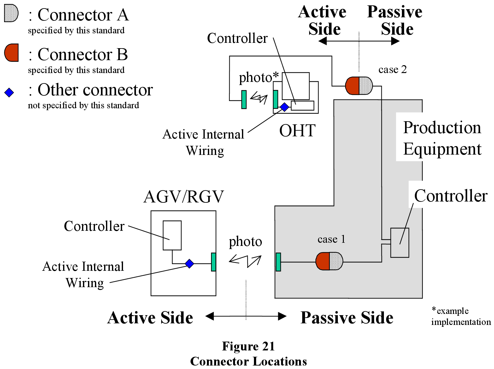

**图 21　连接器位置（Connector Locations）**

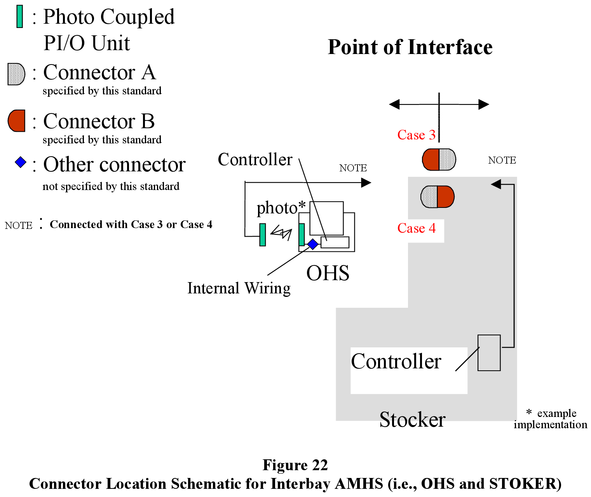

**图 22　跨区 AMHS（即 OHS 与储料机）连接器位置示意图**

**6.4.2** 供电与信号规格如下。

#### 表 8　输入/输出规格

| 主动/被动 | | ON 态 电流 | ON 态 电压 | OFF 态 电流 | OFF 态 电压 |
|---|---|---|---|---|---|
| **输入** Input | | 最大 10 mA | 最大 1.8 Vdc | 最大 200 µA | 最大 30 Vdc |
| **输出** Output | | 最小 25 mA（灌电流 Sink） | 最大 1.8 Vdc | 最大 100 µA（拉电流 Source） | 最大 30 Vdc |

**6.4.2.1 供电电压**：标称 **+24 Vdc**（最小 +18 Vdc，最大 +30 Vdc），从空载到满载（100 mA）。

**6.4.2.2** 对于**硬线（hardwired）**应用，被动侧的电源与电源地**必须**与主动侧的电源与电源地**隔离**。此外，无论是在主动设备还是被动设备内部，电源与电源地都**必须**与信号地（signal common）隔离。

**6.4.3** 位分配（bit assignments）见图 25。

**6.4.4** 6.4.1 节以及图 21、图 22 所要求的连接器引脚分配，由图 26、图 27 与表 9 规定。

**6.4.5** 所有配置都应在符合本标准的每台设备内部包含**信号光电隔离**，以便光传输配置与硬线配置可以共存。参见下文图 23 与图 24。

**6.4.6** 时序图中信号的 **Off 状态**，在硬线配置下对应**无电流流过**，在光发射器配置下对应**无光信号发出**。

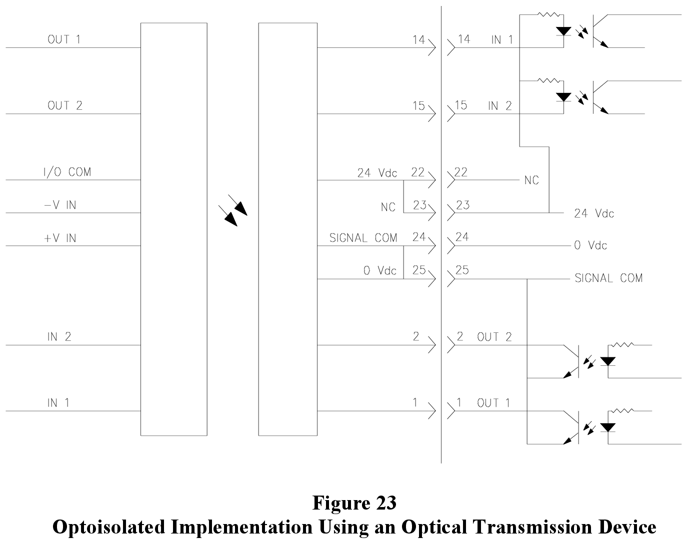

**图 23　使用光传输器件的光隔离实现（Optoisolated Implementation Using an Optical Transmission Device）**

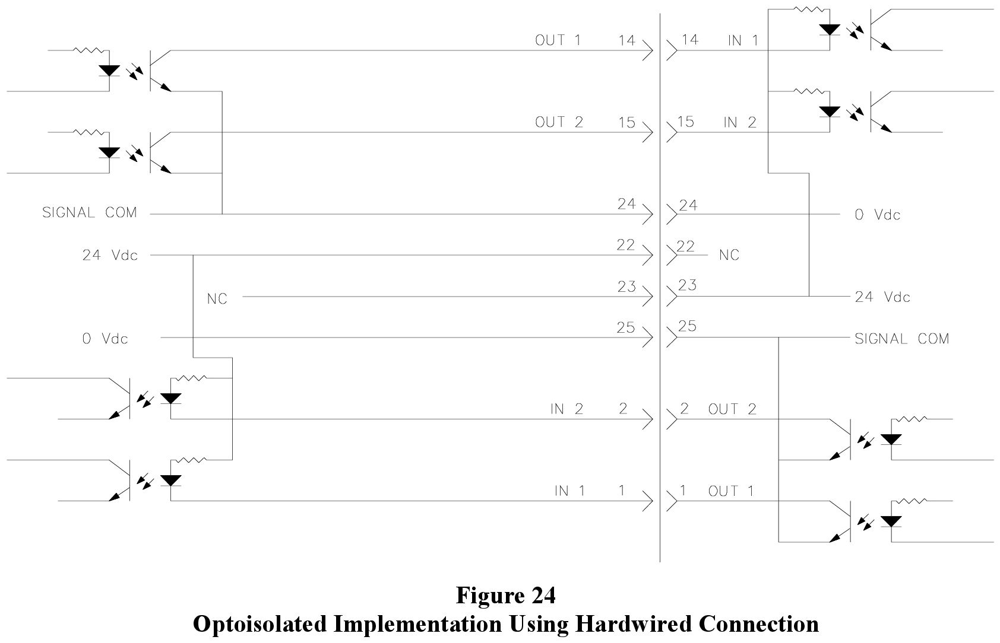

**图 24　使用硬线连接的光隔离实现（Optoisolated Implementation Using Hardwired Connection）**

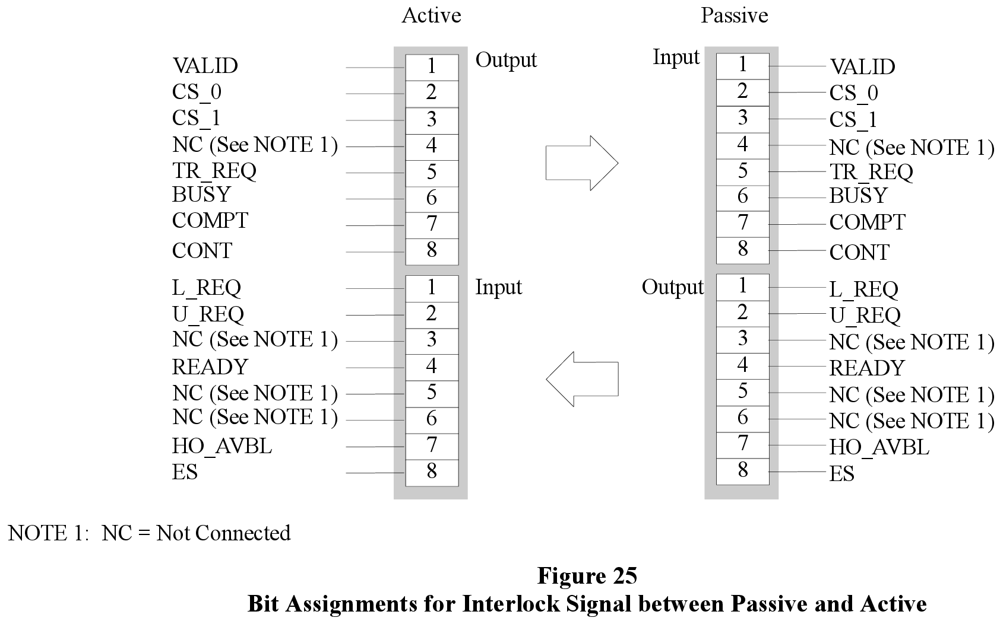

**图 25　被动设备与主动设备之间互锁信号的位分配（Bit Assignments for Interlock Signal between Passive and Active）**

> **注 1**：NC = 不连接（Not Connected）

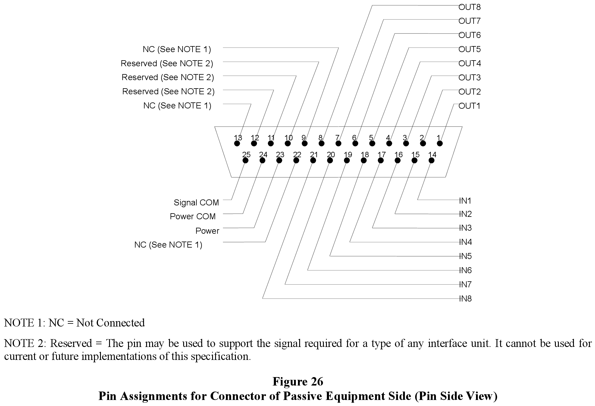

**图 26　被动设备侧连接器引脚分配（引脚侧视图）**

> **注 1**：NC = 不连接。
> **注 2**：Reserved（保留）= 该引脚可用于支持某种接口单元所需的信号。它**不能**用于本规范的当前或将来的实现。

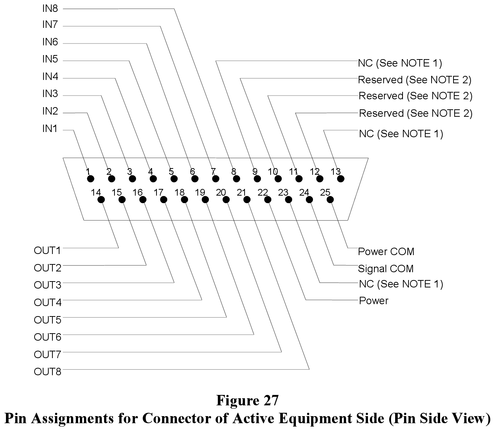

**图 27　主动设备侧连接器引脚分配（引脚侧视图）**

#### 表 9　被动设备侧连接器的引脚分配

| 引脚 # | 被动侧（连接器 A）信号名 | 主动侧（连接器 B）信号名 | 符号 | 方向 | 备注 |
|---|---|---|---|---|---|
| 1 | OUT 1 | IN 1 | `L_REQ`<br>`U_REQ` | P → A | |
| 2 | OUT 2 | IN 2 | `VA` | P → A | |
| 3 | OUT 3 | IN 3 | | P → A | 跨区 AMHS（与被动 OHS、储料机配合使用） |
| 4 | OUT 4 | IN 4 | `READY`<br>`VS_0` | P → A | 跨区 AMHS（与被动 OHS、储料机配合使用） |
| 5 | OUT 5 | IN 5 | | P → A | |
| 6 | OUT 6 | IN 6 | `VS_1` | P → A | 跨区 AMHS（与被动 OHS、储料机配合使用） |
| 7 | OUT 7 | IN 7 | `HO_AVBL` | P → A | |
| 8 | OUT 8 | IN 8 | `ES` | P → A | |
| 9 | NC（见注 1） | NC（见注 1） | NC | — | |
| 10 | Reserved（见注 2） | Reserved（见注 2） | — | — | |
| 11 | Reserved（见注 2） | Reserved（见注 2） | — | — | |
| 12 | Reserved（见注 2） | Reserved（见注 2） | — | — | |
| 13 | NC（见注 1） | NC（见注 1） | NC | — | |
| 14 | IN 1 | OUT 1 | `VALID` | A → P | 不用于跨区 AMHS（与被动 OHS、储料机配合使用） |
| 15 | IN 2 | OUT 2 | `CS_0` | A → P | 不用于跨区 AMHS（与被动 OHS、储料机配合使用） |
| 16 | IN 3 | OUT 3 | `CS_1` | A → P | 不用于跨区 AMHS（与被动 OHS、储料机配合使用） |
| 17 | IN 4 | OUT 4 | `AM_AVBL` | A → P | 跨区 AMHS（与被动 OHS、储料机配合使用） |
| 18 | IN 5 | OUT 5 | `TR_REQ` | A → P | |
| 19 | IN 6 | OUT 6 | `BUSY` | A → P | |
| 20 | IN 7 | OUT 7 | `COMPT` | A → P | |
| 21 | IN 8 | OUT 8 | `CONT` | A → P | |
| 22 | NC（见注 1） | Power | 不适用 | — | 线缆通信时，电源是隔离的。 |
| 23 | Power | NC（见注 1） | 不适用 | — | 线缆通信时，电源是隔离的。 |
| 24 | Power COM | Signal COM | 不适用 | — | 线缆通信时，Power COM 被接到 Signal COM。 |
| 25 | Signal COM | Power COM | 不适用 | — | 线缆通信时，Power COM 被接到 Signal COM。 |

> **注 1**：NC = 不连接。
> **注 2**：Reserved = 该引脚可用于支持某种接口单元所需的信号。它不能用于本规范的当前或将来的实现。
>
> ※ 译者注：表 9 是**现场接线与排故的核心**。注意三点：
> 1. **连接器 A（被动侧）与连接器 B（主动侧）不是简单的"1 对 1 直通"**——引脚 1–13 是"被动侧输出 → 主动侧输入"（P→A），引脚 14–21 是"被动侧输入 ← 主动侧输出"（A→P）。也就是说 A、B 两端的同名 OUT/IN 编号含义相反，做线时必须按本表逐针核对，不能想当然。
> 2. **引脚 22–25 处理电源与地**，其中 24/25 是 Power COM 与 Signal COM 的**交叉**连接。硬线配置下**电源域必须与信号域隔离**（6.4.2.2），这是抗干扰与防地环流的关键。
> 3. **`VALID`/`CS_0`/`CS_1` 占用引脚 14–16，明确标注"不用于跨区 AMHS"**；跨区场景改用 `VA`（引脚 2）、`VS_0`（引脚 4）、`VS_1`（引脚 6）、`AM_AVBL`（引脚 17）。这印证了 6.2.2.2 的译者注——**两套信令虽然共用同一个 DB-25，但互不重叠地占用了不同针脚**，因此同一根电缆可以同时支持两种场景，由设备配置决定启用哪一套。

---

### 6.5 接口传感器单元尺寸

**6.5.1** 接口传感器的最大毫米尺寸见图 28。该尺寸包含传感器的电气连接器与电缆的刚性部分所需的体积。对于设计用于处理 300 mm 晶圆载具的系统，接口传感器单元的设计必须使其能够安装到 SEMI E15.1 所定义的**禁入体积（exclusion volume）**之内，且**光轴居中于该禁入体积之中**。

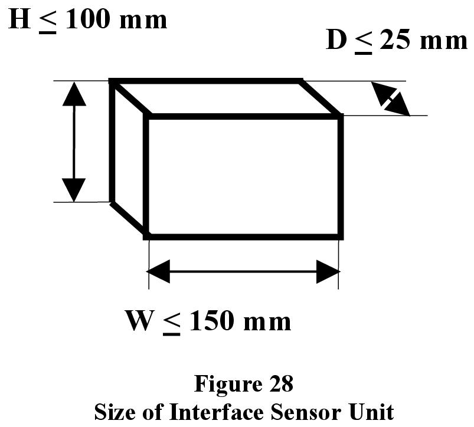

**图 28　接口传感器单元尺寸（Size of Interface Sensor Unit）**

---

## 7 相关文档

### 7.1 SEMI 标准

| 标准号 | 标题 |
|---|---|
| SEMI E4 | SEMI 设备通信标准 1：消息传输（SECS-I） |
| SEMI E5 | SEMI 设备通信标准 2：消息内容（SECS-II） |
| SEMI E15 | 设备载口规范 |
| SEMI E37 | 高速 SECS 消息服务（HSMS）通用服务 |
| SEMI E64 | 300 mm 载车与 SEMI E15.1 对接接口端口暂行规范 |

### 7.2 日本工业标准委员会 <sup>2</sup>

| 标准号 | 标题 |
|---|---|
| JIS-X-5103 | 数据电路终接设备（DCE）与数据终端设备（DTE）之间的接口（37/9 芯接口） |

> <sup>2</sup> 可通过日本标准协会（JSA）获取：4-1-24 Akasaka, Minato-ku, Tokyo 107, Japan
>
> **注 3**：无论列出的还是修订的，所有被引用的文档均应采用已采纳标准的最新版本。

---

## 附录 1　应用说明（APPLICATION NOTES）

> **注**：本附录曾作为 SEMI E84 的正式组成部分参与投票，但本应用说明中的建议为**可选项**，不构成符合本标准所必需的要求。这些说明主要作为帮助应用本标准的信息来源提供，因此**仅应视为参考资料**。

**A1-1** 如果针对空中输送（overhead delivery）与设备的连接采用电气连接器，则图 A1-1 定义了工艺设备或量测设备上**允许放置该插头（plug）的区域**。该区域**独立于** SEMI E15.1 所定义的并行 I/O 设备禁入区。SEMI E15.1 中定义的区域主要面向光电耦合的地面输送系统（如 AGV 或 RGV），而此处定义的、位于被动设备**顶部**的区域主要面向**空中通信用的插头**。如图中所示，插头应位于设备的**顶部或顶部边缘**，并且根据隔墙（bay/chase wall）的位置，可以位于隔墙的任一侧。在某些实施方案中，该隔墙可能并不存在。

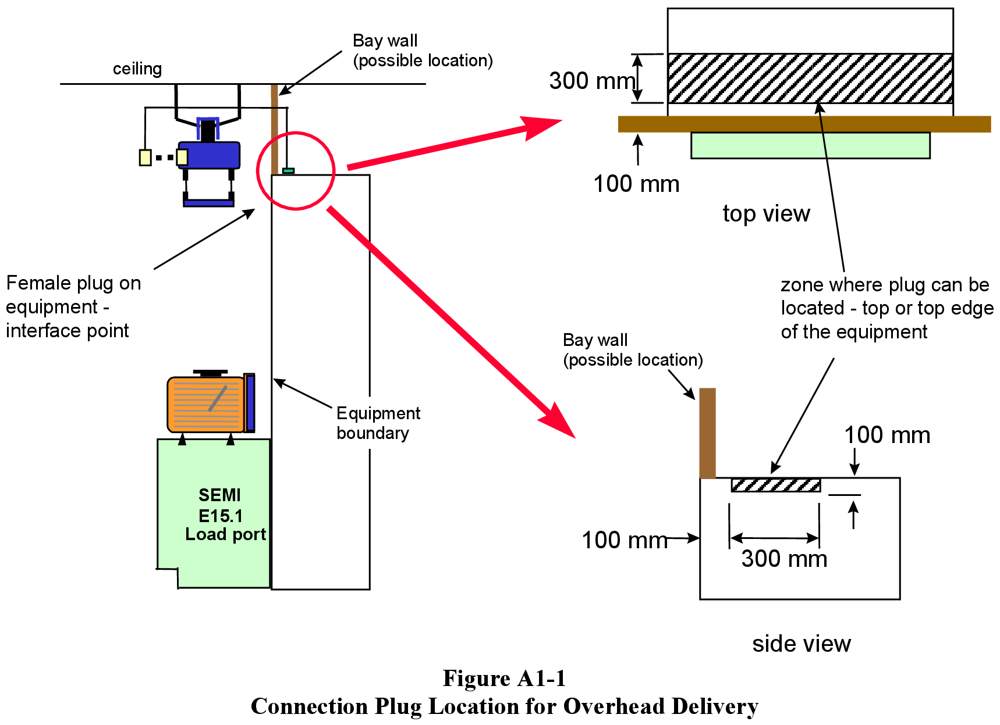

**图 A1-1　空中输送的连接插头位置（Connection Plug Location for Overhead Delivery）**

**A1-2** 由于并行 I/O 通信的固有特性，驱动器与接收器之间的距离应尽可能短。光传输器件可能进一步缩短该距离，具体请咨询器件制造商。

**A1-3** 由于电磁辐射会进入并行导体之间以及导体内部，**任何并行 I/O 通信的应用都无法提供完美的隔离**。所有设备供应商都应采取预防措施，包括但不限于确保信号线具有最小电容，以降低设备受噪声干扰的敏感度。

**A1-4** 设备分为两类：**内部缓存型（internal buffer）**设备与**固定缓存型（fixed buffer）**设备。内部缓存型设备是指**在设备内部使用载口（load port）以外的位置来存放载具**的设备。固定缓存型设备是指**只有固定载口、没有用于载具存放的内部缓存**的生产设备，晶圆直接在载口处从载具中装载和卸载以进行处理。

**A1-5** 本标准规定了两种不同的 PI/O 配置：**每个载口一个 PI/O**，以及**每两个载口一个 PI/O**（图 A1-2）。如果能够**同时**传输一个以上的载具，则载具传输的吞吐量与效率更高。如果厂内 AMHS（intrabay AMHS）设备能够从**同一个停靠位置**同时输送两个或更多载具，则载具传输时间也能缩短。通常，允许向两个载口**同时或连续**交接两个载具的内部缓存型设备，最能利用这些吞吐量的改善。

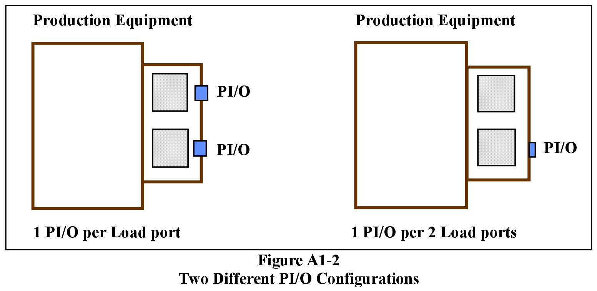

**图 A1-2　两种不同的 PI/O 配置（Two Different PI/O Configurations）**

因此，视 AMHS 输送系统而定，**内部缓存型设备**需要**每个载口一个 PI/O**（图 A1-3，方案 Concept A）或**每两个载口一个 PI/O**（图 A1-3，方案 Concept B）；而**固定缓存型设备**需要**每个载口一个 PI/O 设备**（图 A1-4）。最终用户将根据其生产设备与 AMHS 系统，规定生产设备上所需的 SEMI E84 方案（每个载口一个 PI/O，或每两个载口一个 PI/O）及其位置。

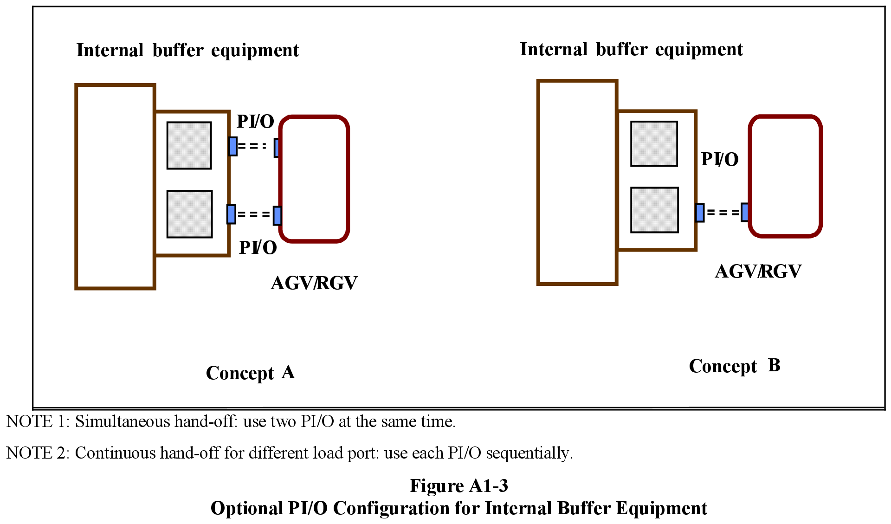

**图 A1-3　内部缓存型设备的可选 PI/O 配置（Optional PI/O Configuration for Internal Buffer Equipment）**

> **注 1**：同时交接（Simultaneous hand-off）：同时使用两个 PI/O。
>
> **注 2**：针对不同载口的连续交接（Continuous hand-off for different load port）：依次使用各个 PI/O。

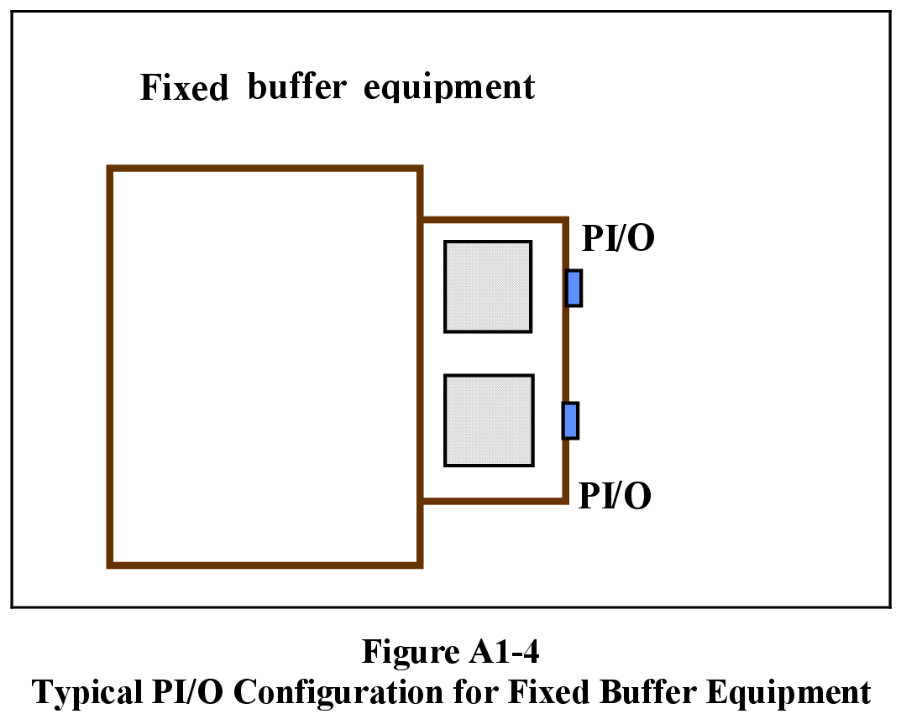

**图 A1-4　固定缓存型设备的典型 PI/O 配置（Typical PI/O Configuration for Fixed Buffer Equipment）**

**A1-6** 图 17 并未定义 PI/O 接口传感器单元的某一特定朝向。图 A1-5 展示了在载口禁入体积（exclusion volume）内，如何为 AGV/RGV 确定 PI/O 器件的朝向。D7、D8、H7、H8 与 W8 的定义请参照 SEMI E15.1。

**A1-7** 本标准将信号的 "ON" 状态规定为 **1.8 Vdc 或更低**。典型的 TTL 电路通常要求下拉到 **0.8 Vdc 或更低**。对于硬线连接，某些 TTL 输入电路可能**无法识别 0.8 Vdc 至 1.8 Vdc 之间的 "ON" 状态**。一种可能的实现方式是提供**输入接收电路（input receiver circuit）**。

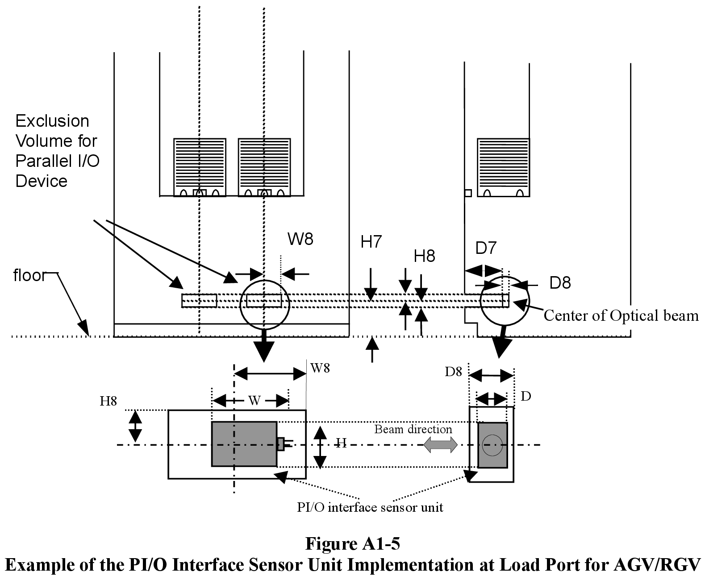

**图 A1-5　载口处 AGV/RGV 用 PI/O 接口传感器单元的实现示例（Example of the PI/O Interface Sensor Unit Implementation at Load Port for AGV/RGV）**

> ※ 译者注：附录 1 虽然"可选"，但信息密度很高，是**做实施方案时最先该看的部分**：
> - **A1-1 解决"空中交接的插头放哪"**——E15.1 的禁入区只管地面光电交接，空中插头的位置是本附录新开的区域（顶部或顶部边缘，靠隔墙任一侧）。
> - **A1-4 / A1-5 是选型的分水岭**：设备是"内部缓存型"还是"固定缓存型"，直接决定用 1 口 1 个 PI/O 还是 2 口 1 个 PI/O。**内部缓存型设备才值得上"同时交接"**（因为它能一次接两个载具），固定缓存型必须每口一个。这条要在采购规格书里写清楚。
> - **A1-7 是现场最容易踩的坑**：标准把 ON 定为 ≤1.8 V，但 TTL 器件普遍按 ≤0.8 V 判低。**用 TTL 直连硬线时，1.0–1.8 V 这段可能既不判 ON 也不判 OFF**。解决办法就是加一级输入接收电路（比较器/施密特触发器），别指望 TTL 门电路能读出来。

---

## 通知（NOTICE）

> **通知**：SEMI 对本文所述标准适用于任何特定应用场景的适用性**不作任何保证或陈述**。标准适用性的判断**完全由使用者自行负责**。请使用者注意参照制造商说明、产品标签、产品数据表以及有关本文提及的任何材料的其他相关文献。**本标准可能在不另行通知的情况下变更。**
>
> 提请使用者注意：本标准的某些实现可能涉及 **Texas Instruments Incorporated 持有的美国专利 4,306,292 及其他已授权或申请中的专利**。通过发布本标准，SEMI 对与本标准所提及的任何事项相关的这些或其他专利权的主张的**适用性或有效性均不持任何立场**。明确告知本标准的使用者：**任何此类专利权的判定，以及侵犯此类权利的风险，完全由使用者自行承担。**

> ※ 译者注：这是 SEMI 标准正文末尾的标准法律声明，各版本措辞略有差异。另注意其原始来源——E84 的并行 I/O 交接机制源于 Texas Instruments 的专利技术，这也是 E84 在半导体设备接口标准中较为特殊的一点。

---

## 相关信息 1　应用说明（RELATED INFORMATION 1）

> **注**：本节曾作为 SEMI E84 的正式组成部分参与投票，但本节的建议为**可选项**，不构成符合本标准所必需的要求。这些说明主要作为帮助应用本标准的信息来源提供，因此**仅应视为参考资料**。

本节描述跨区 AMHS（interbay AMHS，即 **OHS 与储料机 stocker**）的**错误产生与恢复示例**（主要针对主动设备）。以下是在传输操作（装载 load、卸载 unload）过程中**可能发生**的错误。

> 这些流程是**为具备相当 AMHS 设备知识的技术人员**设计的。错误恢复应**始终遵循设备手册中规定的恢复流程**。

### R1-1　OHS（主动型）错误示例

#### 表 R1-1　装载操作错误

| 序号 | 错误描述 | OHS 反应 |
|---|---|---|
| 1 | 装载事务期间，`L_REQ` 未在规定时间内变为 OFF。 | 装载操作序列停止，并显示错误。 |
| 2 | 传输过程中任意时刻检测到装载操作失败或停止定位失败。 | 同上 |
| 3 | 装载操作过程中任意时刻，装载机（loader）上的载具存在状态与当前操作的实际状况不符。 | 同上 |
| 4 | 输出 `TR_REQ` 信号后，`READY` 信号未在规定时间内变为 ON。 | 同上 |
| 5 | 装载操作过程中 `READY` 信号变为 OFF。 | 同上 |
| 6 | 装载操作完成后 `L_REQ` 信号仍保持 ON。 | 同上 |
| 7 | 输出 `COMPT` 信号后，`READY` 信号未在规定时间内变为 OFF。 | 同上 |
| 8 | 装载操作过程中任意时刻，光传输光束被打断。 | 同上 |

#### 表 R1-2　卸载操作错误

| 序号 | 错误描述 | OHS 反应 |
|---|---|---|
| 1 | OHS 移动到储料机（执行卸载操作）并输出 `VALID` 信号，但 `U_REQ` 信号在规定时间内一直保持 OFF。 | 卸载操作序列停止，并显示错误。 |
| 2 | 传输过程中任意时刻检测到卸载操作失败或停止定位失败。 | 同上 |
| 3 | 卸载操作过程中任意时刻，装载机上的载具存在状态与当前操作的实际状况不符。 | 同上 |
| 4 | 输出 `TR_REQ` 信号后，`READY` 信号未在规定时间内变为 ON。 | 同上 |
| 5 | 卸载操作过程中 `READY` 信号变为 OFF。 | 同上 |
| 6 | 卸载操作完成后 `U_REQ` 信号仍保持 ON。 | 同上 |
| 7 | 输出 `COMPT` 信号后，`READY` 信号未在规定时间内变为 OFF。 | 同上 |
| 8 | 卸载操作过程中任意时刻，光传输光束被打断。 | 同上 |

### R1-1.1　传输操作中产生错误时的信号状态示例

#### R1-1.1.1　OHS 侧产生错误

**R1-1.1.1.1　OHS 侧信号** —— 产生错误时，`BUSY` 信号**必须保持 ON**。这样做是为了防止另一方设备自主动作而引发**二次事故**。

**R1-1.1.1.2　储料机侧信号** —— 产生错误时，各信号（**`READY` 信号除外**）应**保持在错误发生时刻的状态**。`READY` 信号应变为 **OFF**。

#### R1-1.1.2　储料机侧产生错误

**R1-1.1.2.1　储料机侧信号** —— 产生错误时，各信号应保持在错误发生时刻的状态。

- `READY` 信号应为 **OFF**。
- `ES` 信号应为 **OFF**。
- `HO_AVBL` 应为 **OFF**。

**R1-1.1.2.2　OHS 侧信号** —— 产生错误时，**只有 `BUSY` 信号应变为 ON**，其余所有信号应变为 **OFF**。

### R1-1.2　恢复顺序

**R1-1.2.1** 若在传输操作期间发生错误（参见表 R1-1 与表 R1-2），恢复应**从"把载具退回储料机或 OHS"开始**。随后应恢复错误。四种恢复场景为：

1. **装载**操作，载具退回**储料机**。
2. **装载**操作，载具退回 **OHS**。
3. **卸载**操作，载具退回**储料机**。
4. **卸载**操作，载具退回 **OHS**。

### R1-1.3　恢复方法

#### R1-1.3.1　OHS 侧

- 对于上述**场景 2**，装载/卸载序列应**从头重新开始**。
- 对于上述**场景 3**，相应的传输操作应被**取消**。
- 对于上述**场景 1 和 4**，相应的传输操作应**视为已完成**。

#### R1-1.3.2　储料机侧

- 对于上述**场景 1 和 4**，相应的传输操作应**视为已完成**。
- 对于上述**场景 2 和 3**，装载/卸载序列应**从头重新开始**。

### R1-2　储料机（主动型）错误示例

#### 表 R1-3　装载操作错误

| 序号 | 错误描述 | 储料机反应 |
|---|---|---|
| 1 | 卸载事务期间，`L_REQ` 未在规定时间内变为 OFF。 | 装载操作序列停止，并显示错误。 |
| 2 | 传输过程中任意时刻检测到装载操作失败或停止定位失败。 | 同上 |
| 3 | 装载操作过程中任意时刻，装载机上的载具存在状态与当前操作的实际状况不符。 | 同上 |
| 4 | 输出 `TR_REQ` 信号后，`READY` 信号未在规定时间内变为 ON。 | 同上 |
| 5 | 装载操作过程中 `READY` 信号变为 OFF。 | 同上 |
| 6 | 装载操作完成后 `L_REQ` 信号仍保持 ON。 | 同上 |
| 7 | 输出 `COMPT` 信号后，`READY` 信号未在规定时间内变为 OFF。 | 同上 |
| 8 | 装载操作过程中任意时刻，光传输光束被打断。 | 同上 |

#### 表 R1-4　卸载操作错误

| 序号 | 错误描述 | 储料机反应 |
|---|---|---|
| 1 | 储料机（执行卸载操作）输出 `VALID` 信号，但 `U_REQ` 信号在规定时间内一直保持 OFF。 | 卸载操作序列停止，并显示错误。 |
| 2 | 传输过程中任意时刻检测到卸载操作失败或停止定位失败。 | 同上 |
| 3 | 卸载操作过程中任意时刻，装载机上的载具存在状态与当前操作的实际状况不符。 | 同上 |
| 4 | 输出 `TR_REQ` 信号后，`READY` 信号未在规定时间内变为 ON。 | 同上 |
| 5 | 卸载操作过程中 `READY` 信号变为 OFF。 | 同上 |
| 6 | 卸载操作完成后 `U_REQ` 信号仍保持 ON。 | 同上 |
| 7 | 输出 `COMPT` 信号后，`READY` 信号未在规定时间内变为 OFF。 | 同上 |
| 8 | 卸载操作过程中任意时刻，光传输光束被打断。 | 同上 |

### R1-2.1　传输操作中产生错误时的信号状态示例

#### R1-2.1.1　储料机侧产生错误

**R1-2.1.1.1　储料机侧信号** —— 产生错误时，`BUSY` 信号**必须保持 ON**，以防止另一方设备自主动作而引发二次事故。

**R1-2.1.1.2　OHS 侧信号** —— 产生错误时，各信号（**`READY` 信号除外**）应保持在错误发生时刻的状态。`READY` 信号应变为 **OFF**。

#### R1-2.1.2　OHS 侧产生错误

**R1-2.1.2.1　OHS 侧信号** —— 产生错误时，各信号应保持在错误发生时刻的状态。

- `READY` 信号应为 **OFF**。
- `ES` 信号应为 **OFF**。
- `HO_AVBL` 应为 **OFF**。

**R1-2.1.2.2　储料机侧信号** —— 产生错误时，**只有 `BUSY` 信号应变为 ON**，其余所有信号应变为 **OFF**。

### R1-2.2　恢复顺序

**R1-2.2.1** 若在传输操作期间发生错误（参见表 R1-3 与表 R1-4），恢复应**从"把载具退回储料机或 OHS"开始**。随后应恢复错误。四种恢复场景为：

1. **装载**操作，载具退回 **OHS**。
2. **装载**操作，载具退回**储料机**。
3. **卸载**操作，载具退回 **OHS**。
4. **卸载**操作，载具退回**储料机**。

### R1-2.3　恢复方法

#### R1-2.3.1　储料机侧

- 对于上述**场景 2 和 3**，装载/卸载序列应**从头重新开始**。
- 对于上述**场景 1 和 4**，相应的传输操作应**视为已完成**。

#### R1-2.3.2　OHS 侧

- 对于上述**场景 1 和 4**，相应的传输操作应**视为已完成**。
- 对于上述**场景 2 和 3**，装载/卸载序列应**从头重新开始**。

> ※ 译者注：R1-1 与 R1-2 是**镜像对称的两套**——只要把"OHS"与"储料机"互换，结构和规则完全一致。抓住三条核心逻辑即可：
> 1. **出错时出错方要"钉住" `BUSY`（保持 ON）**。这是全篇最重要的一条安全设计意图：`BUSY` 保持 ON 等于向对方宣告"我出问题了，别自己动"，从而**防止对方自主动作造成二次事故**。
> 2. **`READY` 一律拉 OFF**——因为"准备好"已经不成立了；而在**被动侧**出错时还要额外拉掉 `ES`（停止请求）和 `HO_AVBL`（交接可用），即**宣告整个交接点不可用**。
> 3. **恢复的判据是"载具落在谁手里"**，而不是"操作到哪一步"：载具退回到**发起方自己**手里（场景 2、3）→ 序列**从头重做**；载具退回到**对方**手里（场景 1、4）→ **本次操作视为已完成**（因为交接的物理目标其实已经达成了）。这一条判断错了，就会造成同一载具被重复搬运或载具丢失。

---

## 相关信息 2　应用说明（RELATED INFORMATION 2）

> **注**：本节曾作为 SEMI E84 的正式组成部分参与投票，但本节的建议为**可选项**，不构成符合本标准所必需的要求。这些说明主要作为帮助应用本标准的信息来源提供，因此**仅应视为参考资料**。

如果储料机是跨区 AMHS（即 OHS 与储料机）的**主动侧**，则可以想见：在故障场景下，装载机（loader）**可能会干扰经过储料机的 OHS**。鉴于这种可能性，跨区 AMHS 设备制造商有必要**在 SEMI E84 互锁之外另行设置一个 OHS "PASS OK" 信号**。但本注与 SEMI E84 的内容**没有直接关系**，因此 SEMI E84 的读者**只应将其作为参考条目**看待。

#### 通过互锁（Pass Interlock）

#### 互锁信号

| 信号名 | P/A | 描述 |
|---|---|---|
| `PASS OK` | A → P | 当该信号为 HIGH（ON）时，车辆（vehicle）**可以**通过。当该信号为 LOW（OFF）时，车辆**不得**通过。 |

> ※ 译者注：这一条讲的是一个**标准覆盖不到的场外风险**：当储料机是主动方时，它的装载机械手/缓存位可能与正在通过（pass by）的 OHS 车辆发生空间冲突。E84 的互锁只管"交接这一刻"，管不了"路过这一刻"，所以需要厂商**额外**加一个 `PASS OK` 信号做通过许可。注意它**不属于 E84**，接线和针脚也**不在表 9 之列**，需要自行规划（表 9 中的 Reserved 引脚正是为这类扩展预留的）。

---

## 相关信息 3（RELATED INFORMATION 3）

> **注**：本相关信息**不是 SEMI E84 的正式组成部分**，而是源自 E84 任务组（E84 Task Force）的工作成果。本相关信息经委员会于 **2000 年 10 月 19 日**投票批准发布。

**R3-1** E84 任务组在 2000 年 10 月投票的 E84 条目变更集中，**无意中遗漏了**随附的信息与定义。为帮助澄清标准，SEMI 物理接口与载具委员会（SEMI Physical Interfaces and Carriers Committee）于 2000 年 10 月 19 日批准增补本相关信息。E84 任务组计划在下一个投票周期将这些定义提交投票，以纳入 E84 标准。

### R3-1.1　在以下术语中增加带下划线的文字

**access mode（访问模式）** —— 一种模式，在该模式下被动设备**知道**哪一台 AMHS 设备（即 RGV、AGV 和 OHT/OHV）或操作员被**允许**进行物料交接。就跨区 AMHS 而言，这是一种被动设备知道哪台 AMHS 设备（即 OHS 以及配备传输装置的储料机）被允许进行物料交接的模式。

**automated material handling system (AMHS) equipment（自动物料搬运系统设备）** —— 一台具有载具传输机器人、可在被动设备之间往返传输载具的设备。它包括有轨制导车辆（RGV）、自动导引车（AGV）、空中吊车输送车（OHT）、空中穿梭车（OHS）以及储料机（stockers）。

### R3-1.2　增加以下术语

**active vehicle（主动车辆）** —— 一台**装有**可将载具从一台设备装载/卸载到另一台设备的装置的主动型 OHS 车辆。

**passive vehicle（被动车辆）** —— 一台**未装有**可将载具从一台设备装载/卸载到另一台设备的装置的主动型 OHS 车辆。

> ※ 译者注：R3-1.1 里的 `access mode` 是理解 E84 与上层调度（MES/AMHS 控制器）接口的关键概念——它解释了一个物理交接点如何**通过配置限定"谁有资格来交接"**（例如某个载口只允许指定的那台 OHT 或某个操作员），这也是 §5 术语中"被动设备"概念的延伸。
>
> 另需注意原文一处**明显的笔误**：`passive vehicle` 的定义写成 "An **active** OHS vehicle that does not contain a device…"，按上下文应为 "An **OHS** vehicle that does not contain…"（被动车辆本身不应是主动型）。本译文按原文直译并在此标注，实际引用时请以上下文逻辑为准。

---

> **文档说明（译者）**：本译文依据 `SEMI E84-0301 SPECIFICATION FOR ENHANCED CARRIER HANDOFF`（SEMI 1999, 2001）全文译出，图 1–图 28 与图 A1-1–图 A1-5 均自原 PDF 页面截图裁切并嵌入本文件。译文力求忠实于原文的技术表述，信号名、标准号、专利号等标识符保留英文原样。
>
> 原文版权：Copyright by SEMI® (Semiconductor Equipment and Materials International), 3081 Zanker Road, San Jose, CA 95134. 未经 SEMI 明确书面同意，禁止全部或部分复制其内容。
